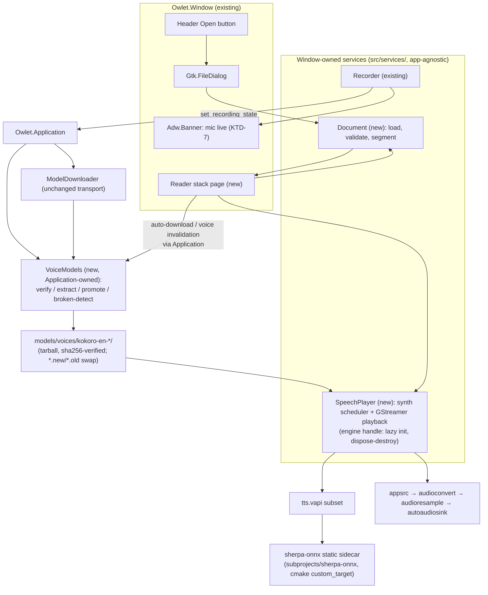
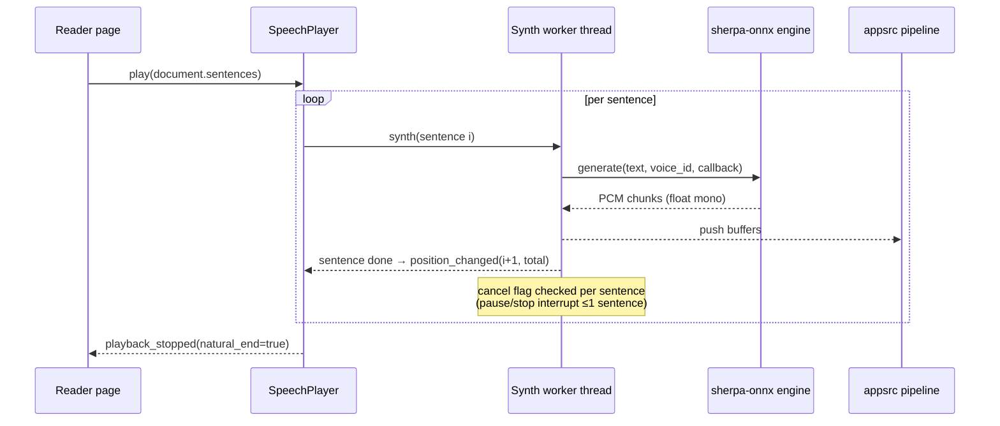

# Local Document TTS - Plan

## Goal Capsule

- **Objective:** Let Owlet read long written documents aloud with a single high-quality neural voice, fully local, so the owner can switch their primary long-doc listening tool from their current TTS.
- **Product authority:** Owlet owner (solo user / product owner).
- **Open blockers:** None — scope decisions confirmed in the 2026-08-22 brainstorm; engine and voice selected in this plan (KTD-1, KTD-2), gated by the owner's pre-integration listening spike (U11).
- **Stop conditions:** Definition of Done satisfied — all automated suites green, flows F1–F3 pass a manual walkthrough, the owner's 30-page listening check is logged, and packaging checks pass on the Arch and AppImage targets (Debian when a builder is available).
- **Execution profile:** Service-led implementation; coverage at the headless helper-CLI + pytest seams (document model, asset pipeline, synthesis); UI covered at smoke level per repo convention.

---

## Product Contract

### Summary

Owlet reads long text documents aloud. The owner opens a plain-text or markdown file and plays it through a single high-quality neural voice, local and offline after the first voice download. v1 is the minimal switch-over experience: open a file, play, pause, stop.

### Problem Frame

Long written documents currently cost the owner silent reading — eyes, stillness, focus drain. The owner already uses TTS for this, but the voices available are monotone enough that long listening sessions don't hold, so they fall back to reading. Owlet today can output speech only as two short notification tones; it has no document surface and no path from text on disk to spoken audio. The goal is a comfortable way to consume long-form text — explicitly not an accessibility screen reader.

### Key Decisions

- **Local-only TTS, no API backend.** The owner declined an API-first option to keep the feature keyless, costless, and private — documents never leave the machine. The price is a quality ceiling set by the best small local engine; the quality bar is enforced at acceptance (Success Criteria), not assumed.
- **One fixed English voice, downloaded on first use.** v1 has one voice and no voice choice. The voice model is a first-class model asset fetched through the existing model download flow and stored with the Whisper models, keeping packages lean; first use needs network.
- **File open as the sole v1 entry point.** Clipboard/paste entry is validated as real value but deferred; the app's own transcript is not a v1 source.
- **User-controlled mic/playback interaction.** No forced rule: the owner may keep the recorder open during playback and accepts that the mic then captures the TTS voice. The app must make that state obvious, not prevent it.

### Requirements

**Document input**

- R1. Owlet opens a plain-text or markdown document from disk and plays it aloud from the start.
- R2. A file that cannot be read as text produces a user-visible error; Owlet does not crash or play garbage.

**Voice**

- R3. Playback uses a single fixed English neural voice; the voice model is downloaded through the existing model download flow and stored alongside the Whisper models in the models directory.
- R4. Voice-model download progress and failure are user-visible; playback cannot start without the model, and the UI says what is missing.

**Playback**

- R5. Transport is play, pause, and stop; pause holds position and resume continues from it.
- R6. Playback is interruptible at any time; stopping or dismissing the document ends audio cleanly.

**Mic interaction**

- R7. Recording can remain open during playback at the user's choice; when both are live the app makes it obvious the mic is open (the TTS voice will be transcribed).

### Key Flows

- F1. First-time listening
  - **Trigger:** Owner opens a document; the voice model is not yet present.
  - **Steps:** The model downloads with visible progress; playback starts once it is ready.
  - **Outcome:** First playback is reached with no manual steps beyond opening the file.
  - **Covers:** R3, R4
- F2. Steady-state listening
  - **Trigger:** Owner opens a document with the voice model present.
  - **Steps:** Play → pause → resume → stop (or dismiss).
  - **Outcome:** Position is preserved across pause/resume; audio ends cleanly.
  - **Covers:** R1, R5, R6
- F3. Listening with the mic open
  - **Trigger:** Owner keeps recording active while a document plays.
  - **Steps:** Playback continues; the app shows the mic is live.
  - **Outcome:** The TTS voice is captured and transcribed — expected behavior, the owner's choice.
  - **Covers:** R7

### Scope Boundaries

**Deferred for later**

- Clipboard/paste entry (validated in the brainstorm, not v1).
- Voice choice (multiple voices) and voice management beyond the single default.
- Remote/API TTS backend (declined for v1; revisitable).
- Playing back Owlet's own transcript.
- Seek/skip, follow-along text, resume across sessions.

**Outside this product's identity**

- Accessibility screen reader behavior.
- System-wide read-aloud of text in arbitrary apps.
- Voice cloning or custom voices.

#### Deferred to Follow-Up Work

- Markdown fence/front-matter stripping in the text-preparation seam (KTD-4 keeps v1 verbatim; the seam makes this an additive change).
- Navigation chrome for the window pages (tab/switcher bar); v1 navigates via the header Open button and the reader's close action.
- Desktop-file `MimeType`/`%F` association (file-manager "Open with Owlet") and the matching `HANDLES_OPEN` CLI/DBus open handler — v1 opens documents only through the in-window `Gtk.FileDialog`.
- Drag-and-drop document opening.
- Keyboard accelerators for the TTS transport (pointer-only in v1; `win.stop`/Ctrl+S stays recording-only).
- Resuming an interrupted voice download (`.part` reuse).

### Success Criteria

- The owner switches their primary long-document listening from their current TTS to Owlet — the chosen voice holds up on a real long listening session (30+ pages) by the owner's own ear.
- A fresh install reaches first playback with no manual steps beyond opening a file.
- After the voice model is downloaded, playback works fully offline.

### Dependencies / Assumptions

- A local neural TTS engine exists that runs on the target platforms (Arch, Debian, AppImage) within acceptable CPU cost and under a license compatible with GPL-3.0-or-later. Engine and voice selection are planning decisions, gated by the Success Criteria quality bar.
- The existing model download flow and models directory absorb the voice model as a second asset class without breaking Whisper model management.
- GStreamer playback is already a runtime capability (the playback plugin is bundled in the AppImage), so audio output adds no new packaging surface beyond the model itself.

### Outstanding Questions

**Resolved during planning (see Planning Contract)**

- Engine and voice → KTD-1 / KTD-2.
- Markdown and code-block handling in v1 → KTD-4 (verbatim; isolated seam).
- Mic/playback interaction mechanism and indicator shape → KTD-7 (no coupling; banner).
- Document surface placement → KTD-6 (main-window stack page).

### Sources / Research

- Owlet has zero TTS footprint today; the only audio output code is the Phase 11 start/stop tones (`src/services/sound-feedback.vala`), and GStreamer playback is already bundled in the AppImage (`packaging/appimage/build.sh`).
- The only text surface is the editable transcript view (`src/window.ui`); clipboard usage is write-only; there is no document-open surface.
- The local|api transcription duality (`transcription-source` key in `data/im.apodaca.owlet.gschema.xml`, `src/services/transcription-source.vala`) is the established pattern any TTS source would mirror if a remote option is ever added.
- The model catalog and download flow (`src/ui/preferences.vala`) plus the models directory under `$XDG_DATA_HOME/owlet/models/` are the existing asset pipeline the voice model will reuse.

**Product Contract preservation:** unchanged except that the four planning-deferred Outstanding Questions are now resolved by the Planning Contract; no requirement, flow, or scope item was altered.

---

## Planning Contract

### Key Technical Decisions

- **KTD-1. Engine: sherpa-onnx (Apache-2.0) as a second pinned cmake sidecar, statically linked.** It is the only maintained, non-Python native path to a narration-grade voice, it mirrors the exact `custom_target` + `declare_dependency` pattern the root `meson.build` already uses for `subprojects/transcribe.cpp`, and its offline-C-API shape (config struct → generate with progress callback → PCM samples) binds cleanly through a small hand-written VAPI (`src/vapi/tts.vapi`, extending by hand only — the transcribe.vapi rule). VITS/Piper and KittenTTS models also run through the same runtime, so an engine or voice swap later is a config + constant change, not a re-integration. The espeak-ng phonemizer is compiled into the upstream build; its data dir ships inside each official model tarball, so no new system runtime package is introduced. One divergence from the transcribe.cpp shape matters: sherpa-onnx's cmake fetches its onnxruntime and espeak-ng archives at configure time (upstream documents a local-file fallback), so U1's spike enumerates that fetch list on a network-disabled run and U6 takes custody of the archives at the packaging layer.
- **KTD-2. Voice: Kokoro English (Apache-2.0 incl. voices) via the official sherpa-onnx `kokoro-en-v0_19` tarball (fp32, English-only, ~346MB).** Kokoro is the 2025–26 community consensus for long-form/narration quality (Piper is "fine for utility, fatiguing for hours"), and Apache-2.0 covers both engine and voices — the cleanest redistribution story for a GPL app. The asset is one tarball (model + voices + tokens + espeak-ng-data) stored as `models/voices/kokoro-en-v0_19/`, with a sha256 pinned beside an ordered URL list in the catalog (primary upstream, fallback an Owlet-controlled mirror uploaded at pin time; pin rotation is a release event with mandatory license re-verify and an ear sanity re-run). The single voice is stored as an explicit name→sid constant beside the catalog pins with a citation of the artifact's published roster (v0_19: af, af_bella, af_nicole, af_sarah, af_sky, am_adam, am_michael, bf_emma, bf_isabella, bm_george, bm_lewis). Default: `af_bella` (sid 1) pending the owner's ear check in U11 — `af_heart` is deliberately not the default: it does not exist in the v0_19 roster (only in the multi-lang artifacts). The int8 RAM path requires the multi-lang v1_1 artifact and is revisited only if the U11 RSS measurement demands it; fp32 v0_19 is the committed variant.
- **KTD-3. Position model: sentence index over streaming per-sentence synthesis via an `appsrc` pipeline.** The document is segmented into sentences once; a worker synthesizes sentence-by-sentence and pushes PCM into an `appsrc` pipeline (audioconvert → audioresample → autoaudiosink). Pause flushes the audio immediately and holds the sentence index; resume re-synthesizes at most one sentence. Stop and natural end halt and reset position to the start — only Pause preserves position. This bounds first-audio latency to ~seconds on a 30-page document (whole-document render would take minutes and ~GBs of RAM) and makes "position" a well-defined integer instead of a PCM offset. In-flight audio is bounded to at most one sentence: appsrc's queue holds one sentence of PCM (the worker's push blocks when full), `position_changed` reports the sentence the pipeline accepted, and pause-flush therefore discards exactly the ≤1 in-flight sentence that resume re-synthesizes. The reader renders position as a secondary label ("i / N sentences"): frozen on pause, reset immediately on stop and natural end, hidden outside document states. The repo's only existing audio-output precedent (`Gtk.MediaFile` in sound-feedback) is the rejected alternative here — see Alternatives Considered.
- **KTD-4. Markdown is read verbatim in v1, behind an isolated text-preparation seam.** Fences, front matter, and markup are spoken as plain text. Segmentation and a single `prepare` seam sit between file bytes and the synth scheduler so fence-skipping or front-matter stripping lands later as an additive change without touching transport or the position model.
- **KTD-5. Voice asset pipeline: composition, not extension — `Owlet.VoiceModels` owns asset policy; `Owlet.ModelDownloader` stays a pure transport.** The downloader remains an untouched "URL → file" primitive (Whisper and voice both fetch through it, preserving its signal surface and the test-helper CLI's link surface). A new Application-owned `Owlet.VoiceModels` owns the voice catalog constants, sha256 verification (via `GLib.Checksum`), tar extraction (via a minimal libarchive VAPI consumed only by this service), directory promote, and installed/broken detection into `models/voices/<voice-id>/`. Both the downloader and `VoiceModels` are owned by `Owlet.Application`; the single-flight busy guard lives on `VoiceModels` itself as observable state (`download_in_progress` / `busy_changed`) — headless-linkable for `voice_cli` — surfaced by the Application so the reader page and Preferences both render in-flight state. A second initiation is rejected with a user-visible message naming the in-flight transfer; cancellation applies only to transfers the cancelling surface initiated. Missing **and** corrupt/invalid voice assets surface as the same NoVoice ("voice not ready") state with a Re-download action — a stored-but-broken asset is treated as missing.
- **KTD-6. Document surface: a new page in the main window's `GtkStack`, with transport in a bottom action bar.** Entry is a header-bar Open button driving `Gtk.FileDialog` with a Text & Markdown filter (plus All Files). No separate window/dialog, no drag-and-drop, no `MimeType` association in v1. Record/Stop/Dictate action gating is decoupled from the visible stack page — gated on a persisted transcription-`source_ready` flag instead (the `loading`-page state keeps Record disabled because the flag is false) — so the mic can stay open while the reader page is visible; the visible-page coupling was an implementation convenience, not a product rule.
- **KTD-7. Mic-live indicator: an `Adw.Banner` pinned above the window content, visible on every page whenever the recorder is live.** Driven solely by the same `set_recording_state` funnel that fans out to the tray icon — identical "mic open" semantics by construction. No mic/playback coupling, no setting: both transports are always allowed independently (R7). The banner is in-window and page-independent because the existing indicators (tray icon, dictation HUD, Record button state) are each invisible from at least one place the listener sits.
- **KTD-8. Text acceptance rule: UTF-8 with no NUL bytes; empty is a first-class state.** Binary or non-UTF-8 content without a recognized BOM yields a friendly "not text" error; UTF-16/32 BOM yields an explicit "unsupported encoding" error (transcoding is a later addition); empty/whitespace-only files get a dedicated empty-document state with disabled transport rather than an error. This makes R2's "no garbage playback" testable.

### High-Level Technical Design

Component topology — new services follow the existing ownership tiers; services stay Application-agnostic (only the window layer references `Owlet.Application`):

Playback state machine — transport semantics per KTD-3 (Pause is the only position-preserver):

```mermaid
stateDiagram-v2
  [*] --> NoDoc
  NoDoc --> Ready: open + voice present
  NoDoc --> Downloading: open + voice missing (auto-download)
  Downloading --> Ready: verified
  Downloading --> NoVoice: failed/cancelled
  NoVoice --> Downloading: retry / re-download
  Ready --> Playing: auto-play on ready with document
  Playing --> Paused: pause (flush; hold sentence index)
  Paused --> Playing: resume (re-synthesize ≤1 sentence)
  Playing --> Stopped: stop / natural end (reset to start)
  Paused --> Stopped: stop (reset to start)
  Stopped --> Playing: play (from start)
  Playing --> NoDoc: dismiss / replace document
  Paused --> NoDoc: dismiss / replace document
  Stopped --> NoDoc: dismiss / replace document
  Downloading --> NoDoc: cancel + dismiss
  NoVoice --> NoDoc: dismiss
```

Synthesis data flow — one sentence at a time, cancellable between sentences:

### Alternatives Considered

Engine and voice options surveyed (2026 landscape), with KTD-1/KTD-2 the resulting picks; integration alternatives follow from the KTD list above:

| Alternative | Verdict | Why not (for v1) |
|---|---|---|
| Piper (GPL-3.0 engine, libpiper or same sherpa-onnx runtime) | Fallback, not default | Quality bar: "audibly synthetic", fatiguing on hour-long narration; the fallback is one constant/config away through sherpa-onnx |
| KittenTTS (Apache-2.0 engine + models) | Watchlist | Developer-preview maturity; native path exists via sherpa-onnx but less long-form evidence |
| Coqui XTTS v2 | Rejected | Weights under non-commercial CPML → redistribution blocker |
| F5-TTS | Rejected | Pretrained weights CC-BY-NC → redistribution blocker; GPU-oriented |
| Mimic 3 | Rejected | AGPL + stagnant since ~2022 (maintained only via forks) |
| Supertonic | Rejected | Technically ideal shape (MIT, 99M, ONNX) but upstream announced archival/no-support (2026-07) |
| Python sidecar (reference `kokoro` package + misaki) | Rejected | Violates the no-Python-at-runtime bar and heavy packaging cost on all three targets |
| speech-dispatcher / system TTS | Rejected | Delivers distro voices (typically non-neural espeak) — fails the quality bar by construction |
| Per-sentence WAV through `Gtk.MediaFile` (the sound-feedback precedent) | Rejected | Async re-prepare per sentence breaks narration continuity; position degrades to a clock offset vs. KTD-3's sentence index; no sample-accurate chaining; pause-flush has no clean expression |
| Extend `ModelDownloader` in place with extract/verify/promote | Rejected | Keeps transport "URL → file" pure and the test helper's link surface clean (the helper CLI links only glib/gio/libsoup); asset policy belongs to `VoiceModels`, which alone consumes the libarchive VAPI |
| Whole-document pre-render, then play | Rejected | Minutes to first audio and ~GBs memory on 30-page documents; lose pause granularity |
| Separate reader window/dialog | Rejected | Splits the banner/transport surfaces and duplicates window-lifecycle handling; the stack page keeps one window to reason about |
| Pinned upstream prebuilt sherpa-onnx release libs (download-and-link) instead of a source sidecar | Rejected | We stick to pinned *source* (submodule or downloaded archive): source builds keep binary provenance in distro toolchains/flags, avoid an unused-feature shared-lib surface plus AppImage .so staging, and stay consistent with the transcribe.cpp precedent; the foregone convenience is priced by the configure-time-fetch custody work in U1/U6 |

### Risks & Dependencies

| Risk | Impact | Mitigation |
|---|---|---|
| Chosen voice fails the owner's ear check | v1 success criterion unmet | Pre-integration listening spike (U11) decides the voice before any build work, using upstream's prebuilt artifacts; on failure the plan moves to the Piper medium fallback through the same runtime before the U1 pin is chosen (constant + config change) |
| Kokoro peak RAM (~2GB reported for fp32) hurts low-RAM machines | Playback stutter/OOM on 8GB systems | Measure peak RSS in U11 and record the result; if uncomfortable, evaluate the official multi-lang int8 artifact (contains `af_heart`, sid 3) — the only real int8 Kokoro build — with a fresh ear sanity check; do not chase nonexistent English-only int8 artifacts |
| sherpa-onnx fetches onnxruntime + espeak-ng archives at configure time | Offline/network-isolated Debian builds fail; Arch fetches undeclared sources; every build depends on upstream URLs surviving | U1's spike enumerates the full fetch list on a network-disabled configure run and records it inline in `meson.build` comments; U6 takes package custody of the pinned archives (Arch `source=()`, debian/rules pre-seed, AppImage staging) so configure resolves them from the build dir; otherwise the sidecar keeps the transcribe.cpp shape |
| espeak-ng data-dir wiring drifts between sherpa-onnx releases | Silent synth failure for the voice | Pin the submodule release; the U4 network test asserts real audio from the real tarball, catching config drift at build time |
| ~300MB first-run download UX | Abandoned first-run downloads | Same magnitude as the existing Whisper small model; visible progress + retry are already required by R4 |
| License/notice compliance for the vendored engine and downloaded voice | Packaging compliance failure on review | Apache-2.0 notices get assigned homes in U6: `packaging/debian/copyright` documents the vendored engine; Arch installs license texts under the package license dir; AppImage stages notice files into the AppDir doc tree; the runtime-downloaded voice's Apache-2.0 license is documented the same way |
| espeak-ng/common-lib ABI drift on Arch vs Ubuntu 26.04/Debian sid | Runtime breakage per distro | Static sidecar absorbs it; only `libarchive` is a new system-linked dep and it is stable across all targets |
| Voice tarball upstream asset is mutated or deleted (the release tag is mutable) | Fresh installs fail to get the voice until Owlet ships a new pin | Ordered catalog URLs with failover — primary upstream, Owlet-controlled mirror uploaded at pin time — with sha256 pinned; pin rotation is a release event that re-verifies the voice license/notice (U6 homes) and re-runs an ear sanity check |
| Downloader changes regress the Whisper path | Broken existing feature | None taken: `ModelDownloader` is untouched; all new asset policy lives in `VoiceModels`, so the existing integration test cannot regress from this work |

### System-Wide Impact

- **Build system:** a second pinned cmake sidecar (`subprojects/sherpa-onnx`) joins the transcribe.cpp pattern; every build (dev, Arch, Debian, AppImage) grows engine build time and binary size. Unlike transcribe.cpp (fully vendored), sherpa-onnx fetches onnxruntime + espeak-ng archives at configure time; U6 stages those pinned archives for Arch/Debian/AppImage builds. AppImage size increases (CPU-only onnxruntime static) — accepted, measured in U6.
- **Runtime deps:** only `libarchive` is newly linked from the system. The bundled GStreamer plugin set already covers `appsrc`, convert/resample, and `autoaudiosink` — verified in `packaging/appimage/build.sh`.
- **Downloaded-asset policy:** voice asset policy (verify/extract/promote/detect-broken) lives in a new Application-owned `VoiceModels`; `ModelDownloader` is untouched, so Whisper downloads cannot change behavior. The single-flight busy guard moves from the Preferences dialog to Application-shared, observable state.
- **Test harness (affected interface):** helper-CLI + pytest seams are first-class interfaces here — `owlet-download-cli` static-links `model-downloader.vala` under a glib/gio/libsoup-only dependency set, which constrains that file's dependency surface; new services gain helper CLIs under the same `tests/helpers/` pattern, and the helper's meson wiring grows its first sidecar-linked target (`tts_cli`).
- **Engine-handle lifetime:** the sherpa-onnx handle is created lazily on first play-with-voice-present, held by `SpeechPlayer`, and destroyed on `dispose()`; a voice re-download invalidates the handle through the window layer (next play re-creates it). `models/voices/` is deliberately not file-monitored — external deletion surfaces as NoVoice ("voice not ready") at the next play attempt, matching the repo's poll-on-view convention with no `FileMonitor` anywhere.
- **Settings/schema:** no new GSettings keys — the feature needs no toggle (mic interaction is always-allowed; transport is pointer-only). The metadata/schema test suite is unaffected.
- **Recorder interaction:** recording and playback are independent full-duplex pipelines (capture holds `pulsesrc`/`pipewiresrc`; playback holds an output sink). Nothing in either service blocks the other. The mic-live banner hooks only the existing `set_recording_state` funnel — identical "mic open" semantics as the tray icon by construction.
- **License/notice homes:** the vendored engine (Apache-2.0) and the runtime-downloaded voice (Apache-2.0) get assigned notice homes in U6 — `packaging/debian/copyright`, Arch package license dir, AppImage staged doc directory.
- **i18n:** new translatable strings in `src/window.ui`, `src/ui/preferences.ui`, and three new service files added to `po/POTFILES.in` (sorted).
- **Repo knowledge:** `AGENTS.md`, `docs/testing.md`, and `tests/README.md` gain the TTS surface in U7 so the next agent does not plan against a stale map.

### Open Questions

No launch-blocking questions remain. Deferred to implementation time (each has a named default; none blocks the plan):

- **Exact sherpa-onnx release pin and cmake flag set.** Default: latest stable release with Kokoro C-API coverage; minimal CPU-only feature flags. Resolved by the U1 spike.
- **Final voice-id constant within the committed v0_19 roster.** Default: `af_bella` (sid 1), kept beside the catalog pins with a roster citation. Resolved by the U11 ear check; the multi-lang int8 artifact is visited only if the RSS measurement demands it.
- **`autoaudiosink` behavior on the owner's PulseAudio/PipeWire hosts.** Default: no change needed; env override (`OWLET_TTS_SINK=fakesink`) exists for tests. Falls to an explicit sink selection only if a host mis-routes.
- **Tar extraction mechanism.** Default: `libarchive` via a ~6-function hand-written VAPI. Fallback: `GSubprocess tar xjf` if the VAPI proves fussy — noted so the implementer doesn't relitigate.

### Sources / Research

- **Engine landscape (load-bearing for KTD-1/KTD-2):** `github.com/OHF-Voice/piper1-gpl` (GPL-3.0, ecosystem utility default) · `huggingface.co/hexgrad/Kokoro-82M` (Apache-2.0 weights, narration-quality consensus) · `github.com/k2-fsa/sherpa-onnx` + its TTS docs and `kokoro-tts-en-c-api.c` example (Apache-2.0, C API, per-model tarballs including espeak-ng-data, prebuilt libs, same sidecar-cmake build shape as transcribe.cpp) · `github.com/KittenML/KittenTTS` (watchlist) · license blocks on Coqui XTTS (CPML) and F5-TTS (CC-BY-NC) · Supertonic archival notice · Speech Note (`github.com/mkiol/dsnote`) and Home Assistant/NVDA showing the Piper+Kokoro duopoly in Linux app packaging.
- **Local patterns:** the transcribe.cpp sidecar block (`meson.build`), `src/vapi/transcribe.vapi` bind-subset discipline, `src/services/recorder.vala` (pipeline construction, bus-watch ERROR/EOS, dispose-to-NULL), `src/services/sound-feedback.vala` (media lifetime; its `Gtk.MediaFile` async re-prepare is the reason it does not generalize to narration), `src/services/model-downloader.vala` (`.part` + atomic rename, signal-only transport surface), `src/ui/preferences.vala` (catalog const + button rows + `.gguf` scan), `src/window.ui`/`window.vala` (stack pages, action gating, toast surface, `set_recording_state` funnel), `tests/helpers/download_cli.vala` + `tests/integration/test_model_downloader.py` (headless service-test template; the helper's glib/gio/libsoup-only link set pins the downloader's dependency surface), `packaging/appimage/build.sh` `stage_minimal_gstreamer_plugins` (playback elements verified present).
- **Flow analysis:** resolved R1-vs-F2 autoplay tension, Stop/natural-end position semantics, entry-surface absence, per-dialog download guard gap, page-coupled action gating gap, and empty/encoding acceptance rules — folded into KTD-3, KTD-5, KTD-6, KTD-8.
- **Architecture review (deepening):** established the service-layering invariant in use today — services stay Agnostic of `Owlet.Application`; the window layer mediates — and the test-harness interface contract (`owlet-download-cli` links `model-downloader.vala` under a glib/gio/libsoup-only dep set); both are honored by the composition split in KTD-5.

---

## Implementation Units

### U11. Pre-integration listening spike (ear gate)

- **Goal:** Settle the subjective quality verdict and the RAM baseline before any build work, using upstream's prebuilt artifacts — the identical judgment U4 would first reach, moved to the front of the plan.
- **Requirements:** Success Criteria (the voice bar); R3 groundwork
- **Dependencies:** none (first unit; its verdict gates U1–U3)
- **Files:** none committed — scratch scripts and outputs live under the OS temp dir; the recorded verdict lands in the PR/commit notes.
- **Approach:** Download the official prebuilt sherpa-onnx offline-TTS binaries and the official `kokoro-en-v0_19` tarball; synthesize a real ~30-page document from the owner's corpus to WAV with the default roster voice (`af_bella`, sid 1); measure peak RSS during sustained synthesis. Record: the ear verdict (pass/fail + notes), peak RSS, any artifact-adjustment need flagged by the RSS number (the multi-lang int8 artifact with `af_heart` sid 3 is the only real int8 alternative), and the final voice name→sid constant to pin. If the verdict fails, record the switch to the Piper medium fallback through the same runtime — made before any submodule pin exists, not after.
- **Patterns to follow:** none — this is a human-centered spike, deliberately not yet an Owlet artifact.
- **Test scenarios:**
  - The 30-page document completes to WAV without crash or OOM.
  - Verdict, RSS measurement, chosen artifact, and voice constant are all recorded (missing records = gate not passed).
- **Execution note:** This unit intentionally spends half a day of owner listening to avoid weeks of sunk integration; nothing here is committed to the repo, so a "failed" verdict costs listening time and nothing else.
- **Verification:** ear verdict + RSS + artifact/voice constants recorded in the PR/commit notes; U1's pin and U3's catalog cite them.

### U1. sherpa-onnx engine sidecar and VAPI

- **Goal:** The Owlet binary statically links a CPU-only sherpa-onnx TTS engine callable from Vala, mirroring the transcribe.cpp integration exactly.
- **Requirements:** R3 (engine foundation)
- **Dependencies:** U11 (ear verdict + artifact/voice constants)
- **Files:** `.gitmodules` (add `subprojects/sherpa-onnx`, pinned release tag), `subprojects/sherpa-onnx/` (new submodule), `meson.build` (second sidecar block), `src/meson.build` (dependency + sources), `src/vapi/tts.vapi` (+ `src/vapi/tts-shim.c` only if callback glue can't be expressed in the VAPI), `tests/helpers/engine_cli.vala`, `tests/helpers/meson.build`
- **Approach:** Copy the root `meson.build` sidecar pattern: `custom_target` stamp driving `cmake -S -B` with `-DCMAKE_BUILD_TYPE=Release`, `-DCMAKE_POSITION_INDEPENDENT_CODE:BOOL=ON`, and a minimal feature flag set (offline TTS only; disable ASR/TTS extras, JNI, Python, examples, speaker-ID tooling; CPU provider for ONNX runtime), then `declare_dependency` with absolute archive paths + include dirs + `sources: stamp` for ordering. The VAPI binds only the used subset of the offline-TTS C API (create/destroy offline TTS; config struct incl. Kokoro model/voices/tokens/data-dir/threads; generate-with-progress-callback returning PCM + sample rate; the callback's stop/continue return powering U4's interrupt). Pin the submodule to the latest release with stable Kokoro C API — the pin is recorded in `.gitmodules` like the transcribe.cpp pin.
- **Patterns to follow:** root `meson.build:57–253` transcribe sidecar block; `src/vapi/transcribe.vapi` bind-only-the-subset rule; the `dictation_hud_shim` static-library precedent if a C shim is needed.
- **Test scenarios:**
  - Happy path: `meson setup build -Dgpu_backend=cpu && ninja -C build` links the owlet binary with TTS symbols; existing unit and metadata suites stay green.
  - Error path: a helper-CLI (`engine_cli`) handle-construction call against a nonexistent model dir returns an engine failure, no crash, no abort.
  - Integration: the same build succeeds with `-Dgpu_backend=vulkan` and `-Dgpu_backend=hip` (engine is GPU-agnostic; this proves the new dep didn't disturb the backend matrix).
- **Execution note:** Spike-first: verify the minimal cmake flag set and archive list in a scratch sidecar before wiring the stamp target; run a network-disabled configure (`unshare -n …`) against the pinned release to enumerate its full fetch list; record both inline in `meson.build` as comments (the codebase's convention of build comments) for U6's package custody. Delete the scratch sidecar before merge.
- **Verification:** owlet builds and the binary runs on the CPU backend; the `engine_cli` helper links the engine and exercises create/destroy failure paths; existing suites pass unmodified.

### U2. Document model: load, validate, segment

- **Goal:** File bytes become a validated, speech-ready document: an ordered sentence list plus explicit NotText / UnsupportedEncoding / Empty outcomes (KTD-8, KTD-4).
- **Requirements:** R1, R2 (and R5's position foundation)
- **Dependencies:** none (parallel with U1)
- **Files:** `src/services/document.vala` (`Owlet.Document`), `src/meson.build`, `po/POTFILES.in`, `tests/helpers/document_cli.vala`, `tests/helpers/meson.build`, `tests/meson.build` (suite env/depends), `tests/conftest.py` (fixture), `tests/fixtures/document/` (utf8.txt, utf16le.txt, latin1.txt, binary.bin, empty.txt, whitespace.txt, long-paragraph.txt, fenced.md, utf32le.txt, abbreviations.txt, numbers.txt, urls.txt), `tests/unit/test_document_model.py`
- **Approach:** `File.load_contents` → NUL-byte check → `string.validate()` → BOM sniff for UTF-16/32 when invalid → empty/whitespace-only dedicated state. Segmentation: split on sentence terminators [.!?…] followed by whitespace/newline, treat blank lines as hard boundaries, collapse whitespace runs; cap oversized segments by splitting at the last space under a length budget (protects the engine and pause granularity). Four no-split rules keep the index honest on real prose: never split for a terminator between digits; never after a short known abbreviation/honorific set (dr, mr, mrs, ms, prof, fig, approx, etc, e.g, i.e, vs, st, no — case-insensitive); never after single-letter+period sequences (initials, "U.S."); never when the period is embedded in a URL/domain token. `prepare` seam: a single function maps raw text → speech text; v1 returns the text unchanged. All logic is UI-free so the helper CLI covers it headlessly.
- **Patterns to follow:** recorder-service class shape (GLib.Object, explicit signal/method surface); gettext `_("%s").printf` error strings.
- **Test scenarios:** (all through the pytest + CLI harness, unit suite, no Xvfb/keyring)
  - Happy: UTF-8 plain text with paragraphs → sentences in order, content preserved; markdown with a fenced block → fence content present in segments (verbatim seam).
  - Edge: empty file → Empty; whitespace-only → Empty; CRLF line endings normalized; a >budget single paragraph splits into bounded segments; a multi-MB file loads without blowup; abbreviations, decimals, initials, and URLs (`Dr. Smith paid $3.50 at acme.com.`) never split mid-sentence — segment counts and content asserted per fixture.
  - Error: NUL-containing file → NotText; random binary → NotText; UTF-16LE/UTF-32 with BOM → UnsupportedEncoding; Latin-1 high bytes without BOM → NotText; missing path → IO error surfaced distinctly.
  - Integration: CLI stdout contract (status line + sentence count) is what pytest asserts — the app and tests exercise the identical load path.
- **Verification:** new pytest file green under `meson test -C build --suite unit`; existing suites pass unmodified.

### U3. Voice asset pipeline + Preferences voice row

- **Goal:** The Kokoro voice tarball downloads through the Application-shared `ModelDownloader` transport and is verified, extracted, and promoted by a new Application-owned `Owlet.VoiceModels` into `models/voices/<voice-id>/`; Preferences shows voice status with (Re)download; missing or broken assets resolve to one NoVoice ("voice not ready") state (KTD-5).
- **Requirements:** R3, R4, F1 (its download half)
- **Dependencies:** U11 (voice constants); U10 consumes it
- **Files:** `src/services/model-downloader.vala` (unchanged — fetched as a plain file), `src/services/voice-models.vala` (`Owlet.VoiceModels`: catalog const with ordered urls[] + sha256 + voice name→sid mapping + dest dir; sha256 verify via `GLib.Checksum`; extract; promote; installed/broken detection), `src/application.vala` (own the shared downloader + `VoiceModels` + observable busy guard state), `src/ui/preferences.vala`, `src/ui/preferences.ui` (Voice group row: status + (Re)download + progress, mirroring Whisper rows), `po/POTFILES.in`, `src/vapi/archive.vapi` (libarchive subset — ~6 functions, consumed only by `voice-models.vala`), `tests/helpers/voice_cli.vala`, `tests/helpers/meson.build`, `tests/meson.build`, `tests/conftest.py`, `tests/integration/test_voice_assets.py`, `tests/integration/test_model_downloader.py` (must stay green unmodified)
- **Approach:** Composition: `ModelDownloader` stays a pure transport (no libarchive link — the test helper CLI cannot grow that dep; its link surface is glib/gio/libsoup only). `VoiceModels` (Application-owned, in `src/services/`, must not itself depend on `Owlet.Application` so a `voice_cli` helper can instantiate it standalone — the `download_cli` precedent) fetches the tarball through the shared downloader as a plain file (its fetch entry point takes url + expected sha256 as parameters — the catalog consts are the app-side defaults, so `voice_cli` and pytest can inject the loopback fixture's URL and per-test digest, mirroring the `download_cli` argv precedent), verifies sha256 via `GLib.Checksum` against the catalog pin (trying the ordered URLs with failover before failing), extracts into `voices/<id>.new` via the libarchive VAPI subset, then promotes with a two-rename swap: existing `<id>` → `<id>.old`, `.new` → `<id>`, delete `.old`. The pinned token set (artifact id, sha256, voice name→sid) comes from U11's recorded verdict, not re-chosen here. Directory-over-directory rename fails on re-download, so the swap is a deliberately non-atomic two-rename with a startup sweep: `VoiceModels`' state scan treats `.new`/`.old` debris as broken-state cleanup. The single-flight busy guard relocates from the Preferences dialog onto `VoiceModels` itself as observable state (`download_in_progress` readable / `busy_changed` signal) — kept Application-free so `voice_cli` asserts it headlessly — surfaced to both UIs through the Application, with the contract stated plainly: one transfer at a time; each consumer connects only for its own in-flight transfer; a second initiation is rejected with a user-visible message naming the in-flight transfer; cancellation applies only to transfers the cancelling surface initiated. No-break contract for the downloader (structurally guaranteed here): default-constructible, the three signals unchanged, `download_async(string, string, Cancellable? = null)` signature unchanged (the helper CLI passes two args), `completed` still means file destination + `.part` gone, and the file keeps its glib/gio/libsoup-only link set. Preferences gains a Voice section row bound to `VoiceModels` state — it doubles as the in-app consumer proving the Application-owned coordinator before the reader page exists; Preferences' page-show refresh consults the Application busy state so progress renders for a reader-initiated download too.
- **Patterns to follow:** `.part` + `OVERWRITE` move discipline in `model-downloader.vala` (transport, unchanged); Preferences catalog/row pattern; Application-owned-services precedent (constructor-injected, e.g. `GlobalShortcuts`/`Tray`).
- **Test scenarios:**
  - Happy: pytest builds a fixture tar.bz2 (Python `tarfile`, known sha256) served by the loopback fixture → verified → extracted dir contains fixture files; `VoiceModels` reports installed.
  - Re-download over an existing voice dir → two-rename swap completes; result is the new content exactly.
  - Simulated crash between the two renames (fixture debris: leftover `.new` and/or `.old`) → startup/state scan sweeps debris and reports a consistent broken-or-installed state, never wedged.
  - sha256 mismatch → `failed`; nothing remains in `models/` (no partial dir, no `.part`).
  - Truncated/corrupt tarball → `failed` on extract; no partial dir.
  - Cancel mid-download → `failed (cancelled)`; no partial.
  - Second transfer attempt while one is active → rejected via the observable busy guard with a message naming the in-flight transfer (rejection + message mapping asserted headlessly through `voice_cli` against the loopback fixture).
  - Extraction of a tarball missing an expected file (e.g. no tokens.txt) → broken-voice state, not installed → same "voice not ready" resolution.
  - Regression: the existing Whisper downloader integration test passes unmodified.
- **Execution note:** Land this before any reader UI so U10 wires against a proven asset pipeline; keep the unmodified Whisper regression test as the first run of every iteration.
- **Verification:** `meson test -C build --suite integration` green (new file + untouched Whisper test); the `ui` smoke suite still renders Preferences with the new Voice group.

### U4. SpeechPlayer service: streaming synthesis + GStreamer playback

- **Goal:** Given a voice asset and a `Document`, produce interruptible spoken audio with play/pause/resume/stop, sentence-index position, and clean teardown (KTD-3).
- **Requirements:** R5, R6, F2 (and R7 coexistence: playback never touches the recorder's pipeline)
- **Dependencies:** U1 (engine + VAPI), U2 (sentences)
- **Files:** `src/services/speech-player.vala` (`Owlet.SpeechPlayer`), `src/meson.build`, `po/POTFILES.in`, `tests/helpers/tts_cli.vala`, `tests/helpers/meson.build` (link extension noted below), `tests/meson.build` (raise the network suite's 60s cap — the ~345MB tarball download plus synthesis exceeds it), `tests/conftest.py`, `tests/network/test_speech_player.py`
- **Approach:** Engine handle created lazily from the installed voice dir on first play-with-voice-present (Kokoro config: model/voices/tokens/espeak-data dirs, CPU, a thread budget; one voice-id constant, KTD-2 default); held strongly and destroyed in `dispose()` — never per-document re-init, never app-start pre-init. It stays Agnostic of `Owlet.Application`: the reader/window layer initiates downloads and, on voice re-download, calls a player invalidation method so the next play re-creates the handle from the new dir. Synthesis runs on a worker thread; per-sentence PCM buffers are pushed into `appsrc` (audio/x-raw, mono, engine sample rate) → audioconvert → audioresample → autoaudiosink, honoring `OWLET_TTS_SINK` env override; appsrc's queue is sized to one sentence so the worker's push blocks when full — the KTD-3 in-flight bound — and tests run `fakesink` with `sync=true` so backpressure is exercised headlessly. Transport per the state machine: Play starts at the held index; Pause flushes audio, pauses the pipeline, holds the index; Stop/natural end halts and resets to 0; `dispose` forces the pipeline to NULL and joins the worker. Signals: `position_changed (int index, int total)`, `playback_started`, `playback_stopped (bool natural_end)`, `error_occurred (string)`. Thread bounce via `Idle.add`.
- **Test-harness note:** `tts_cli` breaks the existing helper template — it must link the sherpa-onnx static archive and the tts VAPI/shim, wiring mirrors `src/meson.build`'s dependency wiring inside `tests/helpers/meson.build` rather than the current pure-Vala helper file-lists. Acceptable: it stays a separate executable target. In-suite assertions end at synthesize-to-WAV (non-empty bytes + plausible duration); audible playback is a manual checklist item.
- **Patterns to follow:** `recorder.vala` (`ensure_gst_init` static guard, pipeline add/link/bus-watch/ERROR-EOS handling, dispose-to-NULL); `sound-feedback.vala` strong-ref lifetime; `local-source.vala` worker→main-loop bounce.
- **Test scenarios:** (network suite — downloads and extracts the official voice tarball into a tmp dir pytest-side and passes the extracted voice dir to `tts_cli`; skips cleanly offline, mirroring the HuggingFace-check precedent)
  - Happy: synthesize a multi-sentence fixture → `position_changed` fires with increasing indexes through `playback_stopped(natural_end=true)`; `tts_cli`'s WAV output is non-empty with plausible duration.
  - Pause/resume: pause between two `position_changed` events → index frozen; resume → subsequent indexes continue from the held index (no restart from 0).
  - Stop mid-playback → `playback_stopped(false)`; a fresh play starts at index 0.
  - Edge: immediate stop before the first buffer completes — interrupt lands ≤1 sentence, no deadlock, no leaked thread; single-word document plays and ends; empty document is rejected without touching the pipeline.
  - Error: missing voice dir → one `error_occurred`, state returns to NoVoice, no crash; engine generation failure mid-document → error surfaced, pipeline torn down cleanly.
  - Integration (manual, recorded in `docs/testing.md`): playback concurrent with an active recording — both pipelines live, TTS voice lands in the transcript, banner visible (full F3 via U10; this unit proves pipeline independence on a machine with a working PA).
- **Execution note:** The owner's first listening verdict already ran at U11; this unit re-confirms it end-to-end through the real engine + VAPI + pipeline path (30-page document through `tts_cli` to WAV) before U10 wires UI to it. If the verdict fails here, swap to the Piper fallback constant and re-run this unit's verification before U10 starts. Audible playback is a manual checklist item; the suite asserts WAV bytes/duration only. Log the segmenter mis-split rate on the ear-check document as a recorded diagnostic, so mid-sentence choppiness is attributed to segmentation before the voice is blamed.
- **Verification:** `meson test -C build --suite network` green with network; `ninja -C build run` plays a fixture document end-to-end on the dev machine; ear-check verdict (voice + variant + observed peak RSS) recorded in the PR/commit notes.

### U8. Action-gating decoupling (prerequisite refactor)

- **Goal:** Record/Stop/Dictate gating stops depending on the visible stack page, as a strictly behavior-preserving refactor — the reader page cannot exist correctly until this lands (page-based gating would disable the recorder while the user reads).
- **Requirements:** F3 groundwork (R7)
- **Dependencies:** none
- **Files:** `src/window.vala` (`update_action_state` and prepare paths only)
- **Approach:** Introduce a private `source_ready` bool, initialized false, set true only on `prepare_source_async` success and false on failure; `update_action_state()` substitutes `source_ready` for the `visible_child_name == "active"` term and keeps every other conjunct verbatim. Do **not** infer readiness from `source != null` — the source object is assigned before `prepare()` completes, so that form would wrongly enable actions on the `loading` page. Out of scope, deliberately untouched: the global-shortcut entry points (which bypass action gating today) and `on_record`'s defensive `source == null` guard.
- **Test scenarios:**
  - All existing suites pass **with no test edits** — the verification signal for behavior preservation.
  - Manual matrix (logged): empty/loading/active pages × Record/Stop/Dictate produce exactly today's enablement; mid-`loading` state keeps all three disabled.
- **Execution note:** Land as its own commit with zero UI change; "existing suites pass unmodified" stated in the commit message.
- **Verification:** `meson test -C build --suite unit` and `--suite ui` green with no test edits; manual matrix logged.

### U9. Mic-live recording banner

- **Goal:** An `Adw.Banner` announces "mic open" on every window page whenever recording is live (KTD-7, R7).
- **Requirements:** R7, F3 (indicator half)
- **Dependencies:** U8 (so Record works from any page before the banner advertises it)
- **Files:** `src/window.ui`, `src/window.vala`
- **Approach:** One `Adw.Banner` as the second top child of the existing `AdwToolbarView` (after the header bar), pinning above every stack page. Visibility hooks **only** `set_recording_state()` — never the `update_action_state` call sites — so banner semantics are bit-identical to the tray recording icon (including the 250 ms foreground-dictate delay where recording is false, by phase-10 design). Title-only banner, no action buttons. One writer, passive readers: no binding loops.
- **Test scenarios:**
  - Manual visibility matrix (logged): banner appears on record start from any page, disappears on stop; hidden during the 250 ms foreground-dictate delay; hidden by window hide (close-to-tray) while the tray red-light covers it; never coexists visibly with the dictation HUD (background mode only).
  - Existing suites pass unmodified.
  - Test expectation: none beyond the suite-preservation check for automation — the recording path has no headless seam today (phase-10/phase-13 precedent: manual-only).
- **Verification:** placement reviewable in `window.ui`; manual visibility matrix logged; existing suites pass unmodified.

### U5. Reader surface shell

- **Goal:** A reader stack page exists with the open flow and document rendering — no playback wiring — plus the test-only seam the UI smoke test needs.
- **Requirements:** R1, R2 (surface half)
- **Dependencies:** U2 (document model), U8 (gating refactor)
- **Files:** `src/window.ui` (reader stack page, header Open button), `src/window.vala` (incl. the test-only open seam), `po/POTFILES.in` (strings), `tests/ui/test_reader_render.py`
- **Approach:** Reader stack page added to the existing `GtkStack` in `window.ui` (matches how the active page is built today — no new template-class pattern). Header-bar Open button → `Gtk.FileDialog` with a Text & Markdown filter plus All Files; successful load renders the document text in a read-only view and flips to the reader page; error → toast, page unchanged; empty document → dedicated empty state; replacing the current document updates the shell only (playback arrives in U10). A close-document action returns to the transcript page. The smoke test drives a document into the page through a test-only seam: an `OWLET_TEST_OPEN` env var honored alongside the other test env vars at startup, opening the given file into the reader page. No `HANDLES_OPEN`/`open()` handler and no CLI entry path ships in v1 — CLI/DBus open lands together with the desktop-file `MimeType`/`%F` association (Deferred to Follow-Up Work), where its semantics are specified. No Preferences changes in this unit.
- **Test scenarios:**
  - Happy (xvfb smoke): launched with `OWLET_TEST_OPEN=document.md` under xvfb-run, the app lands on the reader page with the document rendered; no Gtk/Adwaita/GLib CRITICALs (stderr scan convention).
  - Empty doc → dedicated empty state renders; close-document returns to the transcript page with reader state cleared.
  - Error: open a binary file → toast + page unchanged (U2 covers detection headlessly; smoke covers the surface path with the binary fixture).
- **Verification:** new `tests/ui/test_reader_render.py` green under `--suite ui`; existing suites pass unmodified.

### U10. Reader playback integration

- **Goal:** Transport wiring, in-page voice/download states, and the playback policies — turning the shell into the working reader.
- **Requirements:** R4, R5, R6, F1, F2, F3
- **Dependencies:** U3 (voice pipeline), U4 (player), U5 (shell), U9 (banner — the F3 scenario asserts it)
- **Files:** `src/window.vala`, `src/window.ui`, `po/POTFILES.in`, `tests/ui/test_reader_render.py` (extended: download-state rendering), `tests/integration/test_voice_assets.py` (headless busy/failure legs)
- **Approach:** Wire Play/Pause/Stop to `SpeechPlayer` signals; NoVoice state page with a Re-download action; downloading state with progress + cancel driven by the Application-coordinator's observable busy state. When the auto-download is rejected as busy because a transfer it didn't initiate is in flight, the reader enters the Downloading state read-only bound to the shared busy signal (progress shown, Cancel hidden for non-initiated transfers) and proceeds to play once the transfer verifies; auto-download on open when the voice is missing, with offline/failure → NoVoice state + Retry. Any download completion on the reader page while a document is loaded — auto, retry, or re-download — transitions Downloading → Ready → Playing (auto-play), matching the state machine's "auto-play on ready with document" edge. Close/replace is always reachable from the reader page in every document-holding state: second-document-open stops and replaces (position lost, no confirmation dialog), and dismissing during a download cancels the transfer. Synthesis latency gets a named surface: a "Preparing voice…" affordance shows from Play/Resume press until the first playback_started/position_changed event, with Pause/Stop still enabled, and drops on first audio (reader-page state only — the service signal surface is unchanged). Position gets a named surface too: a secondary label ("i / N sentences") in the transport bar, frozen on pause, reset to start immediately on stop and natural end, hidden in NoDoc/Downloading/NoVoice/Empty states. Navigating to the transcript page keeps audio running; close-to-tray hide keeps playing; real window close tears the player down (dispose discipline). The reader page initiates auto-downloads and voice invalidation through the Application layer, passing results down into the player — services never reference `Owlet.Application` directly. No Preferences changes in this unit.
- **Test scenarios:**
  - Happy (manual F1/F2): no voice → open doc → auto-download with progress → playback starts automatically; pause → resume continues position; stop → position reset; dismiss ends audio.
  - Download failure mid-auto-download (loopback fixture returning 500 drives the CLI-level leg headlessly; page-level leg manual) → NoVoice state with Retry; retry after recovery proceeds.
  - Integration (manual, logged): F3 — start playback, then Record: banner visible on the reader page, TTS voice lands in the transcript, both stop independently; navigate to the transcript page mid-playback → audio continues; close-to-tray hide → audio continues; real close during playback → clean quit; open a second document mid-play → first stops and is replaced; open a document while a Preferences-initiated download is running → read-only Downloading state (no Cancel), playing on completion; the F1×Preferences rejection message and cancel-ownership rules verified.
  - Existing suites pass unmodified.
- **Verification:** `meson test -C build --suite ui` (extended reader smoke incl. download-state rendering) green; manual scenarios logged; existing suites pass unmodified.

### U6. Packaging: Arch, Debian, AppImage

- **Goal:** All three distribution targets build and run with the engine included; new linking is declared; license/notice obligations have assigned homes.
- **Requirements:** Success Criterion "fresh install reaches first playback" on each target
- **Dependencies:** U1 (build wiring), U4 (runtime pipeline elements confirmed)
- **Files:** `packaging/arch/PKGBUILD`, `packaging/debian/control`, `packaging/debian/rules` (only if the shlib scan needs the new lib noted), `packaging/debian/copyright` (vendored engine + downloaded-voice license entries), `packaging/appimage/build.sh` (assert/verify; stage license/notice files into the AppDir doc tree), `README.md` (build-deps note if it lists them)
- **Approach:** Arch: add `libarchive` to `makedepends`/`_common_depends` (cmake already present); install the vendored engine's Apache-2.0 text under the package license dir per Arch convention. Debian: add `libarchive-dev` to `Build-Depends`, let `dh_shlibdeps` resolve the runtime lib; extend `debian/copyright` with the vendored sherpa-onnx stanza and document the runtime-downloaded voice's Apache-2.0 license. AppImage: linuxdeploy's scan absorbs the static engine and collects libarchive; stage the Apache-2.0 notice texts (engine + voice) into the AppDir doc tree; verify the curated GStreamer set still covers `libgstapp`/`libgstautodetect`/pulse-alsa sinks (it does — no list changes). The engine's configure-time-fetched archives (onnxruntime prebuilt zip, espeak-ng source archive — enumerated by U1's network-disabled spike) are brought into package custody: Arch declares them in `source=()` and pre-seeds the sidecar build dir, debian/rules pre-seeds for network-isolated builders, and the AppImage docker build stages them, so upstream's cmake resolves them from its local-file fallback. Record the final AppImage size delta in the PR notes.
- **Test scenarios:**
  - Arch: `makepkg` build completes; `check()` passes; the built package reaches first playback on a machine without any TTS-related system package.
  - AppImage: docker smoke passes; the AppImage plays a fixture document (or asserts a graceful no-audio-device error, matching current capture behavior under docker).
  - Debian: package builds with the new Build-Depends (when a builder is available; otherwise verified by inspection + the Arch run).
- **Execution note:** Mostly packaging/config — prefer install/runtime smoke verification over unit coverage.
- **Verification:** Arch `makepkg` + `check()` green; AppImage docker smoke green; Debian path green or explicitly deferred with reason; size delta and notice files verified present.

### U7. Repo knowledge update

- **Goal:** The repo map reflects the new subsystem so the next agent doesn't plan against stale docs.
- **Requirements:** none (bookkeeping)
- **Dependencies:** U10, U6
- **Files:** `AGENTS.md` (services list, layout table, dependency list, second-sidecar note), `docs/testing.md` (manual gap list additions), `tests/README.md` (new helpers/suites, network-marker note), `docs/plans/README.md` (status note)
- **Approach:** Add manual test items: 30-page listening ear check; offline after download; corrupt voice-asset recovery; banner visibility on all pages; playback-during-recording; navigate-away-keeps-playing; close-to-tray-hide-keeps-playing; per-target first-play checks. Update AGENTS.md in the same style as previous feature phases.
- **Test scenarios:**
  - Test expectation: none — documentation-only unit (verified by diff review).
- **Verification:** Files updated; no `meson test` surface affected.

---

## Verification Contract

| Gate | Command / method | Applies to |
|---|---|---|
| Full test run | `meson test -C build --print-errorlogs` | Final gate: every unit landed |
| Unit suite | `meson test -C build --suite unit` | U2 (new), U1–U10 regression |
| Integration suite | `meson test -C build --suite integration` | U3 (new + Whisper regression) |
| UI smoke suite | `meson test -C build --suite ui` (Xvfb) | U5, U10 |
| Network suite | `meson test -C build --suite network` | U4 (voice tarball + real synthesis) |
| Behavior-preservation check | Existing suites pass unmodified (unit + ui) | U8, U9 |
| Backend matrix compile | `meson setup build -Dgpu_backend=cpu\|vulkan\|hip` | U1 (all three configure+build) |
| i18n regeneration | `ninja -C build owlet-pot` | U2, U3, U4, U5, U10 strings |
| Arch package | `makepkg` incl. `check()` | U6 |
| AppImage package | `packaging/appimage/build.sh` + docker smoke | U6 |
| Debian package | `packaging/debian` build (when builder available) | U6 |
| Manual F1/F2/F3 + ear check | `docs/testing.md` manual list (added by U7) | U11 (first verdict), U4 (re-confirmation), U10 |

Behavioral skill evaluation: not applicable — this repo ships a desktop app, not agent behavior; verification is the suite + manual gates above.

---

## Definition of Done

**Global**

- All automated suites green: unit, integration, ui, metadata (and network where network is available).
- F1 first-run, F2 steady-state, and F3 mic-open flows pass a manual walkthrough on the dev machine.
- The owner's 30-page listening check is logged with the verdict (voice chosen, variant, peak RSS note) — this is the Success Criterion gate; a failed verdict routes to the Piper fallback constant and re-verification, not to shipping a fatiguing voice.
- Offline-after-download verified (voice present → disable network → full F2 flow works).
- Arch and AppImage packaging checks pass (Debian when a builder is available).
- No abandoned-approach code remains in the diff (spike sidecars, alternate-extraction experiments, and dead constants removed before merge).

**Per-unit**

- U11: ear verdict, RSS measurement, artifact choice, and voice name→sid constant recorded; the proceed/fallback outcome is logged before U1 begins.
- U1: builds on all GPU backends; helper links and exercises engine failure paths; existing suites pass unmodified.
- U2: `test_document_model.py` green; every KTD-8 acceptance rule has an asserting test; existing suites pass unmodified.
- U3: `test_voice_assets.py` green including swap, debris-sweep, corrupt, cancel, busy-guard cases; Whisper downloader test unmodified and green.
- U4: `test_speech_player.py` green under the network suite; end-to-end dev-machine playback observed; listening-check verdict recorded before U10 starts.
- U8: existing suites pass with no test edits; manual gating matrix logged.
- U9: manual banner visibility matrix logged; existing suites pass unmodified.
- U5: `test_reader_render.py` green; open/empty/error/close paths verified in smoke; existing suites pass unmodified.
- U10: extended reader smoke green; manual F1/F2/F3 and policy scenarios logged.
- U6: Arch/AppImage gates green; Debian green or deferred with reason; size delta and notice files verified present.
- U7: doc updates merged in the same change set.
