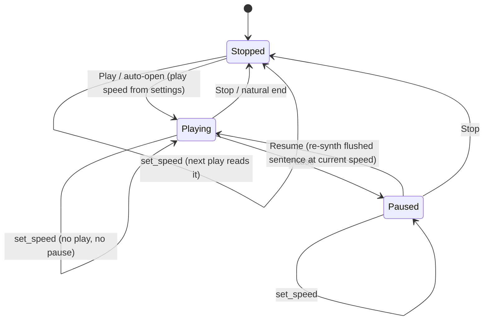
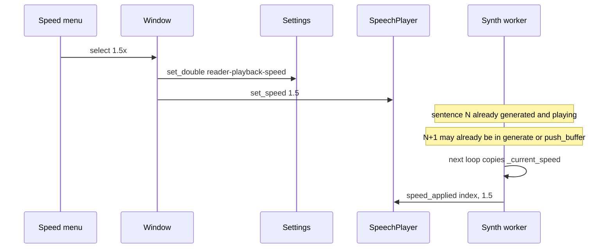

# TTS Playback Speed - Plan

## Goal Capsule

- **Objective:** Let the owner change how fast the document reader speaks, using a small set of labeled speeds that survive across launches, without restarting the sentence that is already playing.
- **Product authority:** Owlet owner (solo user / product owner).
- **Open blockers:** None — control shape, persistence, and mid-listen apply were confirmed in scoping.
- **Stop conditions:** Definition of Done satisfied — unit and network suites green for the new seams, reader smoke stays CRITICAL-free, and the manual speed walkthrough in `docs/testing.md` passes.
- **Execution profile:** Service-led first (`SpeechPlayer` setter + helper CLI), then schema, then reader chrome. Coverage at the helper-CLI + pytest seam; UI at smoke + manual.

---

## Product Contract

### Summary

A compact speed menu on the document reader transport bar. Five labeled rates, remembered across launches, applied to the next sentence that has not started synthesis. Play, pause, and stop stay as they are.

### Problem Frame

Document reading already plays, pauses, and stops (see origin: `docs/plans/2026-08-22-001-feat-tts-document-reading-plan.md`). Long sessions are locked at 1× because the engine's generate `speed` argument is never exposed. The owner already knows how fast they want to listen; they should not have to leave the reader or restart the current sentence to change it.

### Key Decisions

- **Discrete labeled speeds, not a slider.** Governs R1. Five values: 0.75×, 1×, 1.25×, 1.5×, 2×.
- **Remember last speed across launches.** Governs R2. One global setting, not per document.
- **Mid-listen change does not restart the speaking sentence.** Governs R3. The new rate applies to the next sentence that has not started synthesis.

### Requirements

**Control**

- R1. The reader transport bar offers five labeled speeds: 0.75×, 1×, 1.25×, 1.5×, 2×. Default selection is 1×.
- R2. The last chosen speed is stored and reused on the next launch and the next document.

**Apply**

- R3. Changing speed while audio is playing does not flush or restart the sentence currently speaking. The new rate is used for the next sentence that has not started synthesis.
- R4. Play, pause, and stop keep today's semantics. Speed is not a transport command.
- R5. Every fresh Play (auto-open, Play from stopped, Play after natural end, Play after voice download) uses the stored speed, not a hardcoded 1×.

**Scope of the control**

- R6. The speed menu is usable whenever the reader page is showing, including empty, downloading, and no-voice states, so a choice made before auto-play is honored.
- R7. Notification start/stop tones are unchanged.

### Key Flows

- F1. Listen at the remembered speed
  - **Trigger:** Owner opens a document with a voice already installed.
  - **Steps:** Auto-play starts. The first synthesized sentence uses the stored speed. The menu shows that speed.
  - **Outcome:** No extra click to get last session's rate.
  - **Covers:** R2, R5
- F2. Change speed while listening
  - **Trigger:** Owner picks a new rate during play.
  - **Steps:** The speaking sentence continues at the old rate. Later sentences use the new rate. Play/pause/stop still work.
  - **Outcome:** Audio does not restart from the current sentence.
  - **Covers:** R3, R4
- F3. Change speed while paused
  - **Trigger:** Owner pauses, picks a new rate, then resumes.
  - **Steps:** Resume re-synthesizes the flushed sentence at the new rate (pause already dropped that PCM).
  - **Outcome:** Listening continues from the paused sentence index at the new rate.
  - **Covers:** R3, R4
- F4. Change speed before first audio
  - **Trigger:** Owner opens a document while the voice is downloading, or changes speed on a stopped reader.
  - **Steps:** Menu stays enabled. Auto-play or Play uses the chosen rate.
  - **Outcome:** First audio matches the menu, not 1×.
  - **Covers:** R5, R6

### Acceptance Examples

- AE1. Given a stored speed of 1.5×, when the owner opens a document with the voice present, then the first utterance is synthesized at 1.5×. Covers F1 / R5.
- AE2. Given playback is on sentence N, when the owner selects 2×, then sentence N finishes at the old rate and no `play()` restart occurs. Covers F2 / R3.
- AE3. Given playback is paused, when the owner selects 0.75× and resumes, then the flushed sentence is re-synthesized at 0.75×. Covers F3.
- AE4. Given `gsettings` has an out-of-set value such as 1.1, when the reader starts, then the engine is given 1.0 (nearest preset) and the menu shows 1×. Covers R1, R2.

### Scope Boundaries

**Deferred for later**

- Seek/skip, follow-along text, and resume across sessions (already deferred in the origin TTS plan).
- Continuous slider or arbitrary typed rates.
- Per-document speed.
- Independent pitch control.
- Migrating `tts.vapi` from the deprecated positional generate overloads to `SherpaOnnxOfflineTtsGenerateWithConfig` (speed itself is not sunset).
- Rebuilding the appsrc prefetch so a mid-listen change can affect the already-synthesized next buffer without a gap.

**Outside this product's identity**

- Accessibility screen-reader rate.
- System-wide read-aloud of other apps.
- Speed for dictation HUD or notification tones (R7).

#### Deferred to Follow-Up Work

- A pending-rate cue (toast or label) while the current sentence finishes at the old speed.
- Keyboard accelerators for speed.
- Putting the same control in Preferences.

### Success Criteria

- The owner can listen at 1.25× or 1.5× on a real document without restarting the current sentence.
- Closing and reopening Owlet keeps that rate.
- Play, pause, stop, mic-open, and close-to-tray behavior from the origin TTS plan still hold.

---

## Planning Contract

### Key Technical Decisions

- KTD1. **Drive generate `speed`, leave Kokoro `length_scale` at 1.0.** `(session-settled: user-directed — chosen over a continuous slider: five labeled rates are enough and fit a compact bar.)` The five UI values map to `0.75f / 1.0f / 1.25f / 1.5f / 2.0f` on `SherpaOnnx.OfflineTts.generate_with_progress_callback`. Kokoro `length_scale` is an inverse fallback used only when generate `speed == 1`; retuning it would invert 0.75× and 2×. Do not resample already-generated PCM (that would pitch-shift). Governs R1.

- KTD2. **Persist `reader-playback-speed` as a double, snap on read.** `(session-settled: user-directed — chosen over session-only: the owner should not re-pick a rate every launch.)` Schema has no enums. A `d` key default `1.0` matches generate and the `api-temperature` dump form in `tests/unit/test_gsettings.py`. Illegal values (including `gsettings set` of 1.1 or 3.0) snap to the nearest of the five presets, same fallback spirit as `keystroke-backend` → AUTO. Write immediately on menu change. Governs R2, AE4.

- KTD3. **Live setter; next not-yet-generated sentence.** `(session-settled: user-directed — chosen over restarting the current sentence: a rate change must not flush the speaking audio.)` `SpeechPlayer.play()` always `stop_internal`s first, so it cannot be the live path. The worker already copies `_current_speed` at the start of each sentence loop. Add `set_speed(float)` (or a writable property) that snaps and stores; do not call `play()` from the menu. Conflict call-out: `appsrc` `max-buffers=1` plus blocking `push_buffer` means sentence N+1 is often already synthesized while N plays, so the user may hear one extra old-rate sentence (current+2). That is accepted — do not rebuild the prefetch queue in this plan. Pause already drops PCM; resume re-synthesizes the flushed index at the speed then in `_current_speed` (F3). Governs R3, R4, F2, F3.

- KTD4. **Gtk.DropDown in the existing action-bar center box.** Five always-visible toggles overflow the bar at the default 800×600 window. `Adw.ComboRow` is a preferences list row. `Gtk.Scale` is continuous and wants live preview the synthesizer cannot give. Index↔float mapping copies `preferences.vala` `language_row`. Place the dropdown in the center `GtkBox` after Stop, before the separator. Accessible name / tooltip: Playback speed. Governs R1, R6.

### High-Level Technical Design

Transport plus speed — pause remains the only position-preserver; speed is not a transport state:

Mid-listen apply — generate captures speed per sentence; the in-flight buffer is left alone:

### Assumptions

None beyond the confirmed scoping decisions recorded on KTD1–KTD3.

### Risks & Dependencies

| Risk | Impact | Mitigation |
|---|---|---|
| One prefetched sentence stays at the old rate | Menu looks like a no-op on long sentences | Accept per KTD3; no pending cue in this plan |
| `start_reader_playback()` omits speed today | Every Play silently resets to 1× | U3 passes snapped settings into every `play()` |
| `length_scale` mistaken for UI speed | 0.75× speaks faster, 2× speaks slower | KTD1: never change `length_scale`; only generate `speed` |
| DropDown crowding the position label | Unreadable transport at narrow width | Compact dropdown, not five toggles (KTD4) |
| Float store across GTK thread and worker | Torn read of `_current_speed` | Setter writes a single `float`; worker already re-reads per sentence; use the unused `_worker_mutex` only if a race shows up in U1 |

### System-Wide Impact

- **Settings/schema:** first GSettings key for the reader. Metadata schema validator and `EXPECTED_DEFAULTS` must include it. Uninstalled schemas still compile into `build/data/`.
- **SpeechPlayer:** new public speed mutation and a `speed_applied` signal for the helper CLI. `play()` keeps its speed argument for start-from-stopped. Services stay Application-agnostic.
- **VAPI / engine:** no C API change. Positional generate overloads are deprecated upstream in v1.13.6 but still the bound path; migration is deferred.
- **Sound feedback / recorder:** untouched. Dictate-disabled-during-TTS stays as today.
- **i18n:** new translatable tooltip and dropdown labels in `src/window.ui`; schema summary/description; `po/POTFILES.in` already lists those files.
- **Tests:** network suite grows a speed-mutation CLI path; unit suite grows the schema default; UI smoke only guards CRITICALs.

### Open Questions

No launch-blocking questions. Deferred to implementation time:

- Exact widget id and whether `show-arrow` is needed for a compact “1× ▾” chip. Default: `Gtk.DropDown` with arrow, no search.
- Whether `_worker_mutex` is required for the float store. Default: skip until a race is observed.

### Sources / Research

- Origin v1 transport: `docs/plans/2026-08-22-001-feat-tts-document-reading-plan.md` (KTD-3 sentence index, play/pause/stop).
- `src/services/speech-player.vala`: `_current_speed`, `play(..., speed = 1.0f)` after `stop_internal`, worker re-read at each sentence, `length_scale = 1.0f`.
- `src/window.vala` `start_reader_playback()` omits speed; `update_reader_transport_ui()` disables play/pause/stop off the content page.
- `src/window.ui` `reader_action_bar` center box: play / pause / stop / separator / position.
- `data/im.apodaca.owlet.gschema.xml` and `tests/unit/test_gsettings.py` `EXPECTED_DEFAULTS`.
- `src/ui/preferences.vala` ComboRow index mapping (`language_row`).
- `tests/helpers/tts_cli.vala` / `tests/network/test_speech_player.py`.
- sherpa-onnx v1.13.6: generate `speed` > 1 is faster; `speed <= 0` yields empty audio; Kokoro `length_scale` fallback only when `speed == 1`.
- GNOME HIG drop-downs for space-tight exclusive sets.

**Product Contract preservation:** new bootstrap contract for this follow-up; origin TTS Product Contract unchanged. Seek/skip stays deferred.

---

## Implementation Units

### U1. SpeechPlayer speed mutation and helper-CLI proof

- **Goal:** Speed can change without `play()`, later sentences use the new rate, and that is observable without the GUI.
- **Requirements:** R3, R4, F2, F3, AE2, AE3
- **Dependencies:** none
- **Files:** `src/services/speech-player.vala`, `tests/helpers/tts_cli.vala`, `tests/network/test_speech_player.py`
- **Approach:**
  1. Add public preset table + `snap_speed(float)` on `SpeechPlayer`, and `set_speed(float)` that snaps and writes `_current_speed` without touching the pipeline.
  2. Keep `play(..., speed)` as the start-from-stopped path; it still assigns `_current_speed` after `stop_internal`.
  3. Emit `speed_applied (int sentence_index, float speed)` from the worker after capturing speed for that generate, bounced with `Idle.add`.
  4. Extend `owlet-tts-cli`: optional speed on `play`; a `change-speed` command that starts at 1.0, calls `set_speed` after the first `position_changed`, and prints `speed:` lines; pause-resume path that `set_speed`s while paused.
- **Execution note:** Start with a failing network test for `change-speed` before adding the setter.
- **Patterns to follow:** existing `tts_cli` event strings (`event: started`, `position: N / 4`); `pause-resume` Timeout pattern; worker `Idle.add` bounce used for `position_changed`.
- **Test scenarios:**
  - Happy: `play` with speed 2.0 prints `speed:` values of 2.0 for every sentence; existing default `play` still prints positions 1–4 and natural end.
  - Covers AE2. `change-speed` after `position: 1 / 4` does not print a restart from index 0; a later `speed:` line is 1.5 (or 2.0); `event: stopped (natural_end: true)` still fires.
  - Covers AE3. Pause, `set_speed(0.75)`, resume: the re-synthesized sentence reports 0.75; playback continues to the end.
  - Edge: `set_speed(1.1)` reports snapped 1.0 on the next generate; `set_speed(0)` or negative snaps to 0.75, never reaches the engine as `<= 0`.
  - Error: missing voice dir still emits one `error_occurred` and does not crash when `set_speed` is called in STOPPED.
  - Integration: Play / pause / stop commands keep today's event contract with no speed argument (regression).
- **Verification:** `meson test -C build --suite network` green including the new cases; existing play/pause/stop tests unmodified in assertion shape except additive `speed:` lines if default play prints them at 1.0.

### U2. GSettings key and default dump

- **Goal:** The remembered rate has a schema home and a test-pinned default.
- **Requirements:** R2
- **Dependencies:** none (parallel with U1)
- **Files:** `data/im.apodaca.owlet.gschema.xml`, `tests/unit/test_gsettings.py`
- **Approach:**
  1. Add `reader-playback-speed` type `d` default `1.0` with summary/description naming the five intended values.
  2. Add `"reader-playback-speed": "1.0"` to `EXPECTED_DEFAULTS`.
  3. Do not add a schema `<enum>`; snap stays in `SpeechPlayer` (U1).
- **Patterns to follow:** `dictation-auto-stop-threshold` double key + description range prose; phase-17 addition to `EXPECTED_DEFAULTS`.
- **Test scenarios:**
  - Happy: `gsettings list-recursively` dump contains `im.apodaca.owlet reader-playback-speed 1.0`.
  - Edge: `glib-compile-schemas --strict --dry-run` still passes (metadata suite).
  - Error: none at schema layer — illegal doubles are legal GSettings values and are snapped in U1/U3.
- **Verification:** `meson test -C build --suite unit` (`test_gsettings`) and metadata schema validation green.

### U3. Reader dropdown and play-site wiring

- **Goal:** The transport bar shows and changes speed; every Play path passes the stored rate; mid-listen uses the setter.
- **Requirements:** R1, R2, R5, R6, R7, F1, F4, AE1, AE4
- **Dependencies:** U1, U2
- **Files:** `src/window.ui`, `src/window.vala`, `tests/ui/test_reader_render.py`, `docs/testing.md`, `tests/README.md`
- **Approach:**
  1. Add `Gtk.DropDown` (`reader_speed_dropdown`) to the center `GtkBox` after Stop, before the separator. Five translatable labels. Tooltip / accessible name: Playback speed.
  2. On construct, `get_double` → `snap_speed` → select index. On `notify["selected"]`, `set_double` and `player.set_speed`.
  3. Change `start_reader_playback()` to pass the snapped settings value into `play()`. Do not call `play()` from the dropdown handler.
  4. Keep the dropdown sensitive whenever the reader stack page is visible (including empty / downloading / no-voice). Do not hide it with play/pause in `update_reader_transport_ui()`.
  5. Leave `sound-feedback.vala` untouched (R7).
  6. Add a manual recipe under Document TTS reading: change speed mid-play, pause-change-resume, quit/relaunch remembers, download-then-auto-play honors the menu.
- **Patterns to follow:** action-bar `[GtkChild]` + tooltip pattern on play/pause/stop; Preferences `language_row` index mapping; `OWLET_TEST_OPEN` smoke that only scans CRITICALs.
- **Test scenarios:**
  - Covers AE1. Manual: stored 1.5×, open document, first speech is clearly faster than 1×; menu shows 1.5×.
  - Happy (xvfb): existing `OWLET_TEST_OPEN` reader smoke still has no Gtk/Adwaita/GLib CRITICALs with the new dropdown in the bar.
  - Edge: reader on downloading page — dropdown remains enabled; after download, auto-play uses the selected rate (manual F4).
  - Error: binary-file open still toasts and does not crash with the dropdown present (existing smoke).
  - Integration (manual): F2 and F3 walkthrough; close-to-tray and mic-open from origin TTS still hold; notification tones unchanged.
- **Verification:** `meson test -C build --suite ui` green; i18n strings present in `window.ui`; manual list in `docs/testing.md` updated.

---

## Verification Contract

| Gate | Command / method | Applies to |
|---|---|---|
| Unit suite | `meson test -C build --suite unit` | U2 schema default; U1 snap covered via CLI in network |
| Network suite | `meson test -C build --suite network` | U1 speed mutation, pause+speed+resume, play-with-speed |
| UI smoke | `meson test -C build --suite ui` | U3 CRITICAL scan |
| Schema metadata | `Validate schema file` in `meson test` | U2 |
| i18n | `ninja -C build owlet-pot` | U3 strings |
| Manual F1–F4 | `docs/testing.md` Document TTS section | U3 |

Behavioral skill evaluation: not applicable.

---

## Definition of Done

**Global**

- Unit, metadata, and ui suites green. Network suite green when network or the Kokoro cache is available.
- F1–F4 pass a manual walkthrough on the dev machine.
- Origin TTS checks still hold: pause/resume position, stop resets, mic-open, close-to-tray, notification tones.
- No abandoned-approach code remains (no slider prototype, no `length_scale` experiment, no GenerateWithConfig migration).

**Per-unit**

- U1: `change-speed` and pause-then-speed tests green; default play/pause/stop event contract preserved.
- U2: `EXPECTED_DEFAULTS` includes `reader-playback-speed` `1.0`; schema validator green.
- U3: reader smoke CRITICAL-free; `start_reader_playback()` passes snapped speed; dropdown enabled on non-content reader states; manual recipes recorded.
