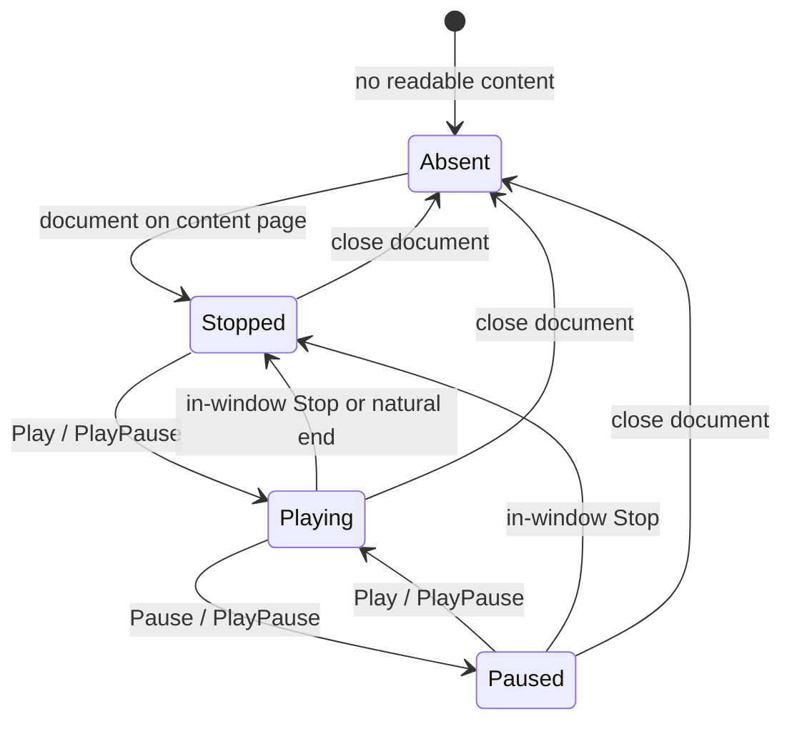
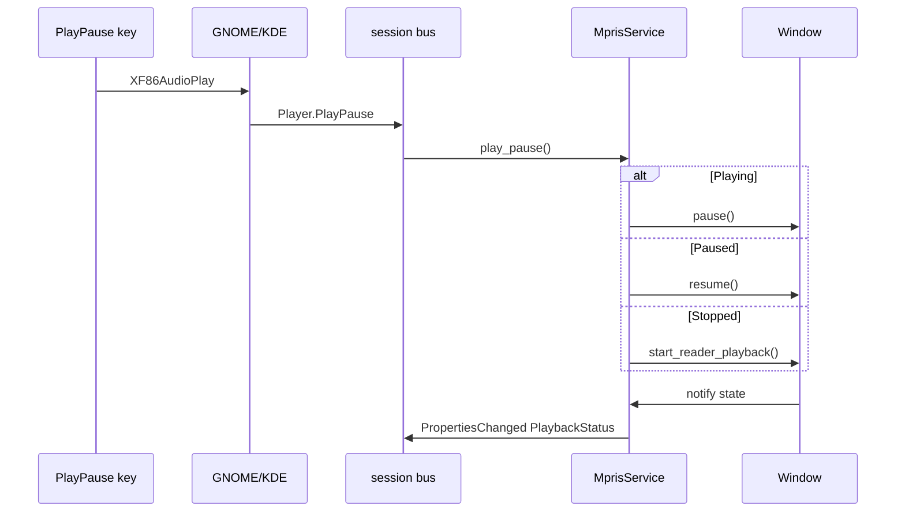

# TTS Media Key Play/Pause - Plan

## Goal Capsule

- **Objective:** Let the owner start, pause, and resume document reading with the keyboard play/pause media key, including when Owlet is unfocused or hidden to the tray, while Owlet is the desktop's current media player.
- **Product authority:** Owlet owner (solo user / product owner).
- **Open blockers:** None — scope confirmed in planning: system-wide while a document is open, Play from stopped starts reading, hardware keys only.
- **Stop conditions:** Definition of Done satisfied — UI suite green for the new D-Bus cases, existing reader/TTS suites stay green, and the manual hardware-key walkthrough in `docs/testing.md` passes.
- **Execution profile:** Window transport wrappers first, then a Tray-style MPRIS D-Bus service, then lifecycle wiring. Coverage at xvfb + session-bus pytest; hardware keys stay manual.

---

## Product Contract

### Summary

Hardware play/pause media keys control document reading the same way the in-window Play and Pause buttons do, while a readable document is open and Owlet is the desktop's current media player, even if another app is focused or Owlet is hidden to the tray. Next, previous, stop, and volume keys stay out, as do in-window accelerators such as Space.

Product Contract originated in this plan (`ce-plan-bootstrap`). Related deferred item from origin: keyboard accelerators for TTS transport remain deferred.

### Problem Frame

Document reading already plays, pauses, and stops from the reader action bar (see origin: `docs/plans/2026-08-22-001-feat-tts-document-reading-plan.md`). Long listening happens with another window focused, or with Owlet closed to the tray. The play/pause media key is the expected control for that, and today it does nothing to Owlet.

### Key Decisions

- **System-wide while a document is open, not focused-window-only.** Governs R1, R2, R5. `(session-settled: user-approved — chosen over focused-window GDK accelerators: media keys must work while listening away from Owlet)`
- **Play with a loaded-but-stopped document starts reading.** Governs R3. `(session-settled: user-approved — chosen over toggle-only-if-already-started: match the in-window Play button)`
- **Hardware media keys only.** Governs R7. `(session-settled: user-approved — chosen over also adding Space / customizable transport shortcuts: those stay deferred with origin v1)`

### Requirements

**Media-key transport**

- R1. The play/pause media key pauses playing narration and resumes paused narration when Owlet is the desktop's current media player.
- R2. Those keys keep working while a readable document is open even if the Owlet window is unfocused or hidden to the tray.
- R3. Play or PlayPause with a loaded-but-stopped document starts reading from the current sentence index, matching the in-window Play button.
- R4. Pause while playing holds position; resume continues from it.

**When keys apply**

- R5. Closing the document releases media-key control so other players can receive the keys.
- R6. Empty, downloading, and no-voice reader states do not take media keys.

**Out of this feature**

- R7. Next, previous, stop, and volume media keys, and in-window accelerators such as Space, are not added. Required D-Bus methods for those keys may exist as successful no-ops.

### Actors

- A1. Owner — the person listening to a document, often with another app focused.

### Key Flows

- F1. Listen away from the window
  - **Trigger:** A1 opens a readable document (voice installed) and focuses another app or hides Owlet to the tray.
  - **Actors:** A1
  - **Steps:** Playback is already running; play/pause media key pauses; the same key resumes.
  - **Outcome:** Audio follows the key; the window need not be focused.
  - **Covered by:** R1, R2, R4
- F2. Start from stopped
  - **Trigger:** A1 has a readable document open and playback is stopped (in-window Stop or natural end).
  - **Actors:** A1
  - **Steps:** Play/pause media key starts reading from the current sentence index (0 after stop).
  - **Outcome:** Narration starts without focusing Owlet.
  - **Covered by:** R3
- F3. Close document returns keys
  - **Trigger:** A1 closes the document.
  - **Actors:** A1
  - **Steps:** Playback stops; Owlet drops media-player presence; later media keys go to another player if one is present.
  - **Outcome:** Owlet no longer intercepts play/pause.
  - **Covered by:** R5

### Acceptance Examples

- AE1. Covers F1 / R1, R2, R4. Given a readable document is playing and Owlet is unfocused or hidden to the tray, when A1 presses play/pause, then narration pauses and holds position; a second press resumes from that position.
- AE2. Covers F2 / R3. Given a readable document is open and playback is stopped, when A1 presses play/pause, then reading starts from the start of the document (index 0 after stop).
- AE3. Covers F3 / R5. Given a document was open, when A1 closes it, then Owlet is no longer a session-bus media player and play/pause no longer affects Owlet.
- AE4. Covers R6. Given the reader is on empty, downloading, or no-voice, when A1 presses play/pause, then Owlet does not claim or consume the key.

### Success Criteria

- With a document playing, the keyboard play/pause key pauses and resumes Owlet while another window is focused.
- After in-window Stop, the same key starts reading again without focusing Owlet.
- After Close, the same key no longer drives Owlet.

### Scope Boundaries

**In scope**

- Play, Pause, and PlayPause as used by GNOME/KDE hardware keys and `playerctl`.
- MPRIS presence only while a readable document is on the reader content page.
- Raise from the desktop media indicator (present the hidden window).

**Deferred for later**

- In-window transport accelerators (Space, customizable `win.reader-*` shortcuts) — origin v1 deferred this; this plan keeps it deferred per R7.
- Next / previous sentence skip from media keys.
- Mapping MPRIS `Stop` to `SpeechPlayer.stop()`.
- Mapping MPRIS `Rate` to the playback-speed dropdown (`docs/plans/2026-08-25-001-feat-tts-playback-speed-plan.md`).
- MPRIS TrackList / Playlists / seek / artwork.
- Claiming keys while no document is open.

**Outside this product's identity**

- Accessibility screen-reader key handling.
- Forcing Owlet to beat a currently-Playing other MPRIS client (GNOME/KDE last-active heuristics are desktop-owned).

#### Deferred to Follow-Up Work

- Phase 18 Flatpak finish-args: default session-bus policy already allows `org.mpris.MediaPlayer2.$FLATPAK_ID` when the bus name is `org.mpris.MediaPlayer2.im.apodaca.owlet`. Confirm in the Flatpak plan; do not add `--socket=session-bus`.
- KDE-only user note if Media Controller must be enabled for keys to route.

---

## Planning Contract

### Key Technical Decisions

- KTD1. **Export MPRIS2, not GlobalShortcuts or GDK.** GNOME and KDE route hardware media keys to `org.mpris.MediaPlayer2.Player`. The portal GlobalShortcuts path is a user-chosen combo for dictation (`toggle-recording`) and cannot claim compositor-reserved `XF86AudioPlay`. The GNOME MediaKeys D-Bus API was removed in 2021. Mirror `src/services/tray.vala` (`[DBus]` + `register_object`) and add `Bus.own_name` for `org.mpris.MediaPlayer2.im.apodaca.owlet` at `/org/mpris/MediaPlayer2`. Instantiates the system-wide Key Decision for R1, R2.

- KTD2. **PlayPause dispatcher is not `on_reader_play`.** `win.reader-play` resumes if paused, otherwise always calls `start_reader_playback()` → `play()`, which restarts the current sentence. The Play button is hidden while playing, so the in-window path never toggles. GNOME remaps the Play key to MPRIS `PlayPause`. Map:
  - Playing → `player.pause()`
  - Paused → `player.resume()`
  - Stopped → `start_reader_playback()` with the same content-page guard as the Play button
  `Play()` is the paused/stopped branches (no-op if already playing). `Pause()` is `player.pause()`. All three methods are in scope for R1–R4. Guard: no-op unless `reader_doc != null` and `reader_content_stack` is `"content"`.

- KTD3. **Own the well-known name for the whole content-page lifetime.** Acquire when a readable document reaches the content page. Release only when leaving that condition (close, empty replace, download/no-voice). Keep the name through pause, in-window Stop, and natural end so F2 works under GNOME's sticky-current client. On document replace, update Metadata in place; do not drop and re-own the name.

- KTD4. **`CanPlay` and `CanPause` stay true while exported.** MPRIS `PlayPause` from Stopped starts playback, but the spec errors if `CanPause` is false. Both properties describe whether a current track exists, not whether audio is currently playing. `CanSeek`, `CanGoNext`, and `CanGoPrevious` stay false. `CanControl` stays true. `CanQuit` is false. `CanRaise` is true; `Raise()` presents the window the same way tray Show does.

- KTD5. **Emit `PropertiesChanged` from `SpeechPlayer.notify["state"]`.** Vala `[DBus]` getters do not emit `org.freedesktop.DBus.Properties.PropertiesChanged`. `pause()` sets `PAUSED` and emits neither `playback_started` nor `playback_stopped`. Every STOPPED / PLAYING / PAUSED transition must emit Player `PlaybackStatus` (and Metadata / Can* when those change). Do not emit PropertiesChanged for `Position` or `CanControl`.

- KTD6. **Stub unused Player methods as successful no-ops.** GNOME still invokes `Stop` / `Next` / `Previous` / `Seek` on the current proxy. Missing methods log D-Bus errors. Per R7, return success and do nothing. Do not map `Stop` to `player.stop()`. `Volume` is a dummy `1.0`; ignore writes. `Rate` / `MinimumRate` / `MaximumRate` are `1.0`; ignore writes (speed stays on the reader dropdown).

- KTD7. **Minimum Root + Metadata.** `Identity` = `"Owlet"`; `DesktopEntry` = `"im.apodaca.owlet"`; `HasTrackList` = false. Metadata includes `mpris:trackid` (a valid object path under `/im/apodaca/owlet/...`, not `/org/mpris/...` except the NoTrack sentinel) and `xesam:title` = document basename. `Position` may be `0`.

### High-Level Technical Design

GNOME's media-key daemon keeps one current MPRIS proxy. Combined Play/Pause sends `PlayPause`. Owlet becomes current when its name appears and nobody else is Playing, or when its `PlaybackStatus` becomes `"Playing"` while the current client is not Playing. A currently-Playing other client keeps the keys (R1's "current media player" qualifier).

Absent means the well-known name is not owned. Stopped / Playing / Paused mean the name is owned and `PlaybackStatus` matches `SpeechPlayer.state`.

Application owns `MprisService` the same way it owns `Tray`. Window publishes document/player state into it. MPRIS methods emit signals (or call public Window wrappers) that run the KTD2 dispatcher. `SpeechPlayer` stays a dumb transport.

### Assumptions

None beyond confirmed scope. Competing-player routing is desktop-owned (see Risks).

### Implementation Constraints

- No new GSettings key, Preferences shortcut row, or Shortcuts-dialog item. Hardware keys are not GTK accelerators.
- Do not extend `Owlet.GlobalShortcuts`.
- Do not change `SpeechPlayer`'s STOPPED / PLAYING / PAUSED machine.
- `win.stop` stays recording-only.
- Single-instance app id `im.apodaca.owlet`; no `.instance<pid>` bus-name suffix.
- D-Bus callbacks marshal onto the GTK main thread before touching Window / SpeechPlayer.

### Sequencing

1. Window PlayPause dispatcher + content-page guard (U1).
2. MPRIS Root + Player objects, `Bus.own_name`, manual PropertiesChanged (U2).
3. Own/release lifecycle, Raise, Metadata, tray-hidden (U3).
4. pytest D-Bus cases + `docs/testing.md` manual matrix (U4).

### Sources & Research

- MPRIS v2.2 Player: https://specifications.freedesktop.org/mpris/latest/Player_Interface.html — `PlayPause` from Stopped starts playback; `CanPause` false makes `PlayPause` error.
- GNOME `mpris-controller.c` remaps Play to `PlayPause`; sticky-current client (appear if not Playing; Playing-wins only when current is not Playing).
- GNOME MediaKeys API removed October 2021 (hadess PSA).
- Vala `[DBus]` does not auto-emit PropertiesChanged: https://docs.vala.dev/sample-code/basics/dbus-basic-samples.html
- In-tree pattern: `src/services/tray.vala` (`register_object`); do not copy `src/services/global-shortcuts.vala` (client portal bind).
- Flatpak default own-name: `org.mpris.MediaPlayer2.$FLATPAK_ID`.
- Origin deferral: TTS v1 pointer-only transport in `docs/plans/2026-08-22-001-feat-tts-document-reading-plan.md`.

---

## Implementation Units

### U1. Window PlayPause dispatcher

- **Goal:** Give Application/MPRIS a public entry that pauses while playing, resumes while paused, and starts from stopped, without restarting the current sentence.
- **Requirements:** R1, R3, R4, R6
- **Dependencies:** None
- **Files:**
  - Modify: `src/window.vala`
  - Test: `tests/ui/test_mpris.py` (added in U4; U1 is proven through U4)
- **Approach:**
  1. Add public wrappers (same style as `toggle_dictation_background()`) that encode KTD2 and the content-page guard from `update_reader_transport_ui`.
  2. Leave `on_reader_play` / `on_reader_pause` as the in-window button path. Do not route MPRIS through `activate_action("reader-play")`.
  3. No-op when `reader_doc` is null or the stack is not `"content"`.
- **Patterns to follow:** `src/window.vala` `on_reader_play` / `on_reader_pause` / `start_reader_playback`; public global-shortcut wrappers near `toggle_dictation_background()`.
- **Test scenarios:**
  - Happy path: while Playing, dispatcher pauses and `SpeechPlayer` stays on the same sentence index.
  - Happy path: while Paused, dispatcher resumes rather than calling `play()`.
  - Happy path: while Stopped with a readable document, dispatcher calls `start_reader_playback()`.
  - Edge: empty / downloading / no-voice — dispatcher no-ops and does not toast a play failure.
- **Verification:** Wrappers exist and are the only path U3 wires to MPRIS Play / Pause / PlayPause. Pause-without-restart is a code/manual check; MPRIS has no sentence-index property.

### U2. MPRIS Root and Player service

- **Goal:** Export `org.mpris.MediaPlayer2` and `org.mpris.MediaPlayer2.Player` on the session bus with spec-shaped methods and manual PropertiesChanged.
- **Requirements:** R1, R7
- **Dependencies:** None (signals/callbacks; Window wiring is U3)
- **Files:**
  - Create: `src/services/mpris.vala`
  - Modify: `src/meson.build`
- **Approach:**
  1. Two `[DBus]` classes on path `/org/mpris/MediaPlayer2` (Root + Player), registered like Tray's two objects.
  2. `Bus.own_name` for `org.mpris.MediaPlayer2.im.apodaca.owlet` (KTD1). Unown + unregister on teardown.
  3. Implement Play, Pause, PlayPause as signals/callbacks for U3. Stub Next, Previous, Stop, Seek, SetPosition, OpenUri as successful no-ops (KTD6).
  4. Manual PropertiesChanged with D-Bus CamelCase keys on the Player interface for `PlaybackStatus`, `Metadata`, and Can* that change (KTD5).
  5. Root: Identity, DesktopEntry, CanQuit=false, CanRaise=true, HasTrackList=false, empty URI/mime arrays (KTD4, KTD7).
- **Patterns to follow:** `src/services/tray.vala` `[DBus]` + `register_object`; elementary Music `MprisPlayer.vala` for PropertiesChanged builders (external).
- **Test scenarios:**
  - Happy path: after own_name, `busctl introspect` shows Root and Player on `/org/mpris/MediaPlayer2`.
  - Happy path: PlayPause / Play / Pause methods exist and are callable.
  - Edge: Next / Previous / Stop return without D-Bus errors and do not change playback.
  - Error: own_name failure is warning-only; the app still runs.
- **Verification:** Source listed in `src/meson.build`; process can own the well-known name when U3 asks.

### U3. Own/release lifecycle and Raise

- **Goal:** Claim MPRIS only on the readable content page, keep it through pause/stop, drop it on close, and present the window on Raise — including close-to-tray.
- **Requirements:** R2, R5, R6; F1–F3
- **Dependencies:** U1, U2
- **Files:**
  - Modify: `src/application.vala`
  - Modify: `src/window.vala`
  - Modify: `src/services/mpris.vala` (if setters live there)
- **Approach:**
  1. Construct `MprisService` in `Application.startup()` next to Tray. Route Play/Pause/PlayPause to the U1 wrappers on `active_window`. Route Raise to tray Show (`present()` plus hide SNI), not `present()` alone.
  2. Window notifies the service when entering/leaving content-page readability, on successful document replace (Metadata only), and on `player.notify["state"]` (KTD3, KTD5). Failed `open_document_file` is not a replace and not Close — keep the previous document's name and Metadata.
  3. Release the name only when leaving the content-page condition (`on_close_doc_action`, empty/no-voice/download) and on shutdown. Do not unown on `playback_stopped`, `player.stop()`, or `error_occurred`.
  4. Hidden window: do not gate on `visible`. Play/Pause/PlayPause never `present()`.
- **Patterns to follow:** `src/application.vala` tray + `active_window` dispatch; `src/window.vala` `on_close_doc_action` / `open_document_file`.
- **Test scenarios:**
  - Covers AE1. Document playing, window unfocused or hidden: PlayPause pauses then resumes.
  - Covers AE2. Document stopped on content page: PlayPause starts playback; name was never released.
  - Covers AE3. After Close, `busctl` no longer lists `org.mpris.MediaPlayer2.im.apodaca.owlet`.
  - Covers AE4. Empty / downloading / no-voice: name is absent.
  - Integration: replace document updates Metadata without a name flicker.
  - Integration: Raise after close-to-tray presents the reader window.
- **Verification:** Name present only on content page; PlaybackStatus tracks pause without a start/stop signal; Close drops the name.

### U4. D-Bus tests and manual hardware-key matrix

- **Goal:** Prove MPRIS name ownership and Close-release under `--suite ui`, without treating process kill or dummy voice files as PlayPause coverage.
- **Requirements:** R5, R6; AE3, AE4. R1–R4 / AE1–AE2 when a real voice is on the isolated test `XDG_DATA_HOME`.
- **Dependencies:** U3
- **Files:**
  - Create: `tests/ui/test_mpris.py`
  - Modify: `src/window.vala` (test-only close seam analogous to `OWLET_TEST_OPEN`, if `win.close-doc` cannot be activated from the harness)
  - Modify: `docs/testing.md`
- **Approach:**
  1. Launch like `tests/ui/test_reader_render.py`, but wrap the app in `dbus-run-session` so a desktop Owlet on the user bus cannot swallow the test instance. Skip the file if `xvfb-run`, `dbus-run-session`, or `busctl` is missing. Poll `NameHasOwner` instead of a fixed sleep.
  2. Always-on `--suite ui` (dummy INSTALLED files may be used only to reach the content page; they do not prove playback):
     - No `OWLET_TEST_OPEN` → name absent.
     - `empty.txt` → name absent (AE4).
     - Dummy installed voice + `utf8.txt` → name present even if synthesis fails; in-process Close (`OWLET_TEST_CLOSE` or equivalent) while the process is still alive → name gone (AE3). Process `kill` must not be the AE3 assertion.
  3. `PlayPause` → `PlaybackStatus` (AE1) and Stopped-then-PlayPause (AE2) need a real Kokoro under that isolated `XDG_DATA_HOME` plus `OWLET_TTS_SINK=fakesink`. If `--suite ui` will not vendor that asset, skip those cases there and do not claim them in the UI gate. Drive AE2 with `win.reader-stop` (or natural end), not MPRIS `Stop` (KTD6).
  4. Assert Next/Stop D-Bus success with unchanged status as an R7 case, separate from in-window Stop.
  5. Hardware keys: add a manual walkthrough under `docs/testing.md` **What is NOT tested**, next to portal GlobalShortcuts (focused, unfocused, tray-hidden, loaded-but-stopped, empty/no-voice, competing Playing player).
- **Execution note:** CI proves bus name and Close. Hardware XF86 keys and pause-without-restart stay manual/code review.
- **Patterns to follow:** `tests/ui/test_reader_render.py` launch env; `dbus-run-session` as in unit GSettings tests; `OWLET_TEST_OPEN` as the only existing file-open seam.
- **Test scenarios:**
  - Covers AE4. Empty fixture open: `NameHasOwner` is false while the process lives.
  - Covers AE3. Dummy-voice content page: name true; after in-process Close, name false while the process still lives.
  - Edge: no document open: name false.
  - Edge: Next/Stop D-Bus calls succeed and leave PlaybackStatus unchanged.
  - Happy path (real voice only): PlayPause toggles Playing ↔ Paused; after in-window Stop, PlayPause becomes Playing (AE1, AE2).
  - Integration: no new Gtk/Adwaita/GLib CRITICALs versus existing reader smoke.
- **Verification:** `meson test -C build --suite ui` always covers name absent/present and Close-release. `docs/testing.md` lists hardware keys as untested in CI.

---

## Verification Contract

| Gate | Command / check | Applies to | Done signal |
|---|---|---|---|
| UI D-Bus | `meson test -C build --suite ui --print-errorlogs` | U4 always-on cases | Name absent/present and in-process Close-release pass; reader smoke stays CRITICAL-free |
| Unit (no Xvfb) | `meson test -C build --suite unit` | regression | Green; no gschema changes expected |
| Network TTS | `meson test -C build --suite network` | SpeechPlayer regression | Existing play/pause/stop helper-CLI cases unchanged |
| Manual | `docs/testing.md` hardware-key walkthrough (under What is NOT tested) | R1, R2, F1, AE1 | Keyboard play/pause pauses/resumes unfocused and tray-hidden playback |

---

## Definition of Done

- U1–U4 complete per their Verification fields.
- PlayPause never restarts a playing sentence.
- MPRIS name is owned only on the readable content page and is released on document close.
- No Preferences shortcut row, no `shortcut-*` key, no Space accelerator.
- Abandoned experiments (extra portal binds, GDK key controllers) are not left in the diff.
- `--suite ui` proves name ownership and in-process Close-release. Hardware keys and pause-without-restart are documented as untested in CI.

---

## System-Wide Impact

Own/release follows content-page readability (KTD3, R5, R6), not `SpeechPlayer` STOPPED. Do not unown on `playback_stopped`, the `open_document_file` pre-stop, or `error_occurred`.

Failed second open is not Close and not replace: `open_document_file` stops playback, then on `NOT_TEXT` / IO error only toasts and leaves the previous `reader_doc` loaded. Keep the name and Metadata for that previous document. The next PlayPause starts it from index 0.

Hide, keys, Raise, and toasts are separate: close-to-tray is not R5. Play/Pause/PlayPause never `present()`. Raise is tray Show (`present()` plus hide SNI). TTS and failed-open toasts stay overlay-only, including when hidden.

MPRIS uses the KTD2 dispatcher only — no extra dictation guards. Dictate is blocked only while `is_playing`; pause re-enables it. Resume/play still stops live dictation via existing `on_player_started`. MPRIS Stop must not call `win.stop` (recording-only).

`error_occurred` is a transport fault, not leave-content. The name stays owned. PlaybackStatus follows real `state` (KTD5); a failed `resume()` can stay PAUSED without a start/stop signal.

SNI recording badge and tray Dictate stay mic/dictation. Do not drive the badge from PlaybackStatus or add tray Play/Pause. Tray Quit relies on U3 shutdown unown while a document may still be open.

Flatpak later needs the bus name to match `im.apodaca.owlet` (KTD1 already does).

---

## Risks & Dependencies

- **Competing Playing client.** Opening a document while Spotify/YouTube is Playing yields dual audio; GNOME keeps keys on the other client until it pauses or vanishes. Accepted for v1; not a bug in Owlet.
- **Appear-while-paused steal.** Registering MPRIS when a document opens switches GNOME if the previous current player is not Playing. Required for F2; accepted surprise versus paused music.
- **Failed open then PlayPause.** Headset Play restarts the still-loaded previous document. Do not release the name to "fix" this (R5 is Close only).
- **Silent failure while hidden.** Synth/open toasts on a hidden overlay are easy to miss. Do not `present()` on `error_occurred` (that fights F1). Recovery is retry PlayPause.
- **Pause, then Dictate, then PlayPause.** Resume stops dictation with no present. Same as in-window Play; do not special-case MPRIS.
- **Exported + broken.** After a transport error the name stays owned (KTD3). Owlet can remain GNOME's current player while audio is dead. Do not unown on error.
- **Release-on-stop footgun.** Hooking unown to `STOPPED` would break F2. Own/release is content-page only.
- **Two bus names while hidden.** Idle tray icon plus a Playing MPRIS client is expected. Do not reuse the recording badge for TTS.
- **KDE Media Controller.** Keys may no-op if the Plasma media widget/service is disabled. Document in the manual matrix; do not add a KDE-only code path.
- **Lock screen.** PlayPause can still reach Owlet. Audio is already audible; no idle-inhibit in this plan.
- **Depends on** in-tree TTS reader (`SpeechPlayer`, reader content page) and a private session bus in CI (`dbus-run-session`).
