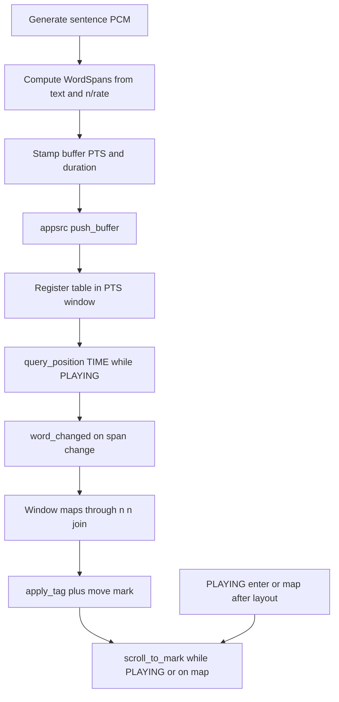
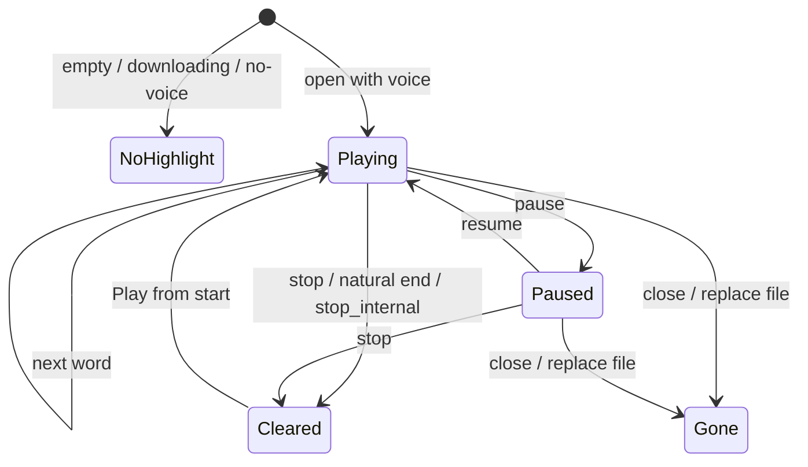
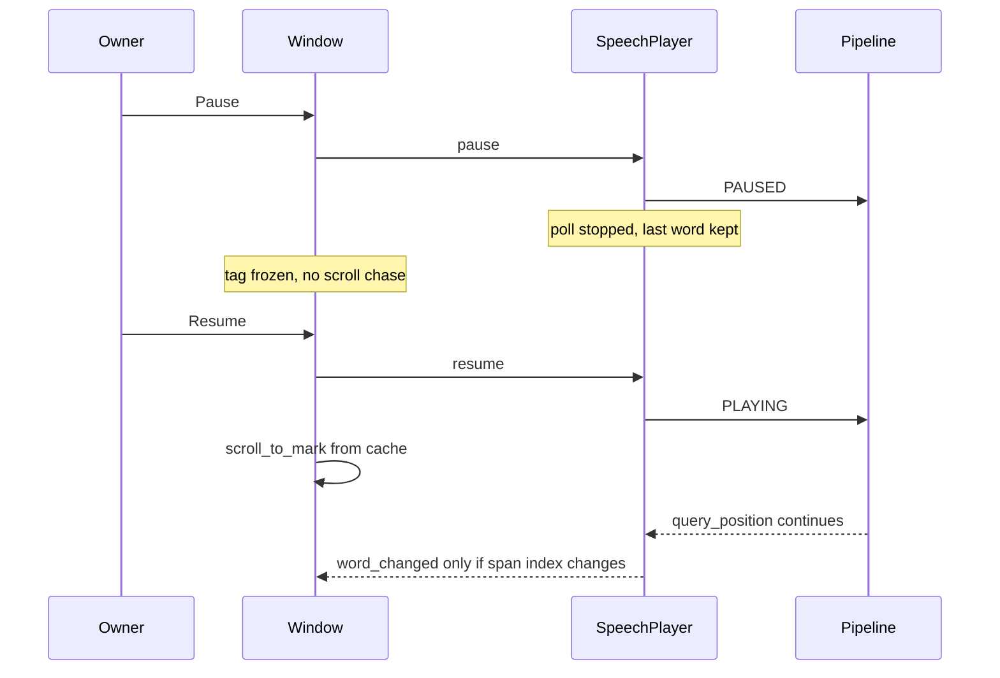

# TTS Word Highlight - Plan

## Goal Capsule

- **Objective:** Highlight the word currently being spoken in the document reader and keep it on screen, in sync with play, pause, resume, stop, and speed, without adding seek.
- **Product authority:** Owlet owner (solo user / product owner).
- **Open blockers:** None — auto-scroll and no click-to-seek were confirmed in scoping.
- **Stop conditions:** Definition of Done satisfied — unit estimator tests green, network speech-player word-clock tests green, reader smoke stays CRITICAL-free, and the manual follow-along walkthrough in `docs/testing.md` passes.
- **Execution profile:** Estimator and player clock first (helper CLI + pytest), then reader tags and scroll. UI at smoke + manual.

---

## Product Contract

### Summary

As the document reader speaks, the current word in the open document is highlighted in time with the audio. The highlight stays on that word while paused, continues from it on resume, and clears on stop, natural end, or close. While playing, the view scrolls just enough to keep that word on screen. Speed-control semantics stay as they are; the highlight follows each sentence's generate duration (R7). This is follow-along in the reader only.

Product Contract originated in this plan (`ce-plan-bootstrap`). Related deferred item from origin: follow-along text is pulled forward. Seek/skip and resume across sessions stay deferred.

### Problem Frame

The reader already plays, pauses, and stops, and it shows the document as sentence text (`docs/plans/2026-08-22-001-feat-tts-document-reading-plan.md`). Position is a sentence count, so during a long listen the owner cannot see which word is being spoken, and a wrapped page can leave the speaking text off-screen. Origin v1 deferred follow-along. This plan supplies it as estimated word karaoke, not as seek.

### Key Decisions

- **Highlight the speaking word, not only the sentence.** Governs R1. The engine has no word timestamps; timing is estimated (KTD1). Digit, URL, and abbreviation expansions are accepted within-sentence drift.
- **Keep the highlight on pause; resume from that word.** Governs R2, R3. Matches live pause-hold PCM, not origin KTD-3's flush-and-re-synth story.
- **Auto-scroll while playing, and restore the current word on screen after hide (playing or paused).** Governs R5, R9. `(session-settled: user-approved — chosen over highlight-only: a word off-screen is not follow-along on a long document)`
- **No click-to-seek.** Governs R6. `(session-settled: user-approved — chosen over click-a-word to jump: Seek/skip stays deferred with origin v1)`

### Requirements

**Highlight**

- R1. While the reader is playing a document, at most one word in the reader text is highlighted: the estimated span currently being clocked (KTD1), not an engine word timestamp. A sentence with no highlightable spans does not invent a word.
- R2. Pause freezes the highlight on that word. It does not clear and does not jump to the start of the sentence.
- R3. Resume continues audio from the held PCM and moves the highlight onward from the frozen word.
- R4. Stop, natural end, document close, opening a different file, and any transport halt that stops audio all clear the highlight. The window-observable triggers are `playback_stopped` (stop, natural end, fatal playback or synthesis error), reader close, and file replace; `play()`'s internal `stop_internal (false)` emits no signal, so the reader's own open / auto-play path clears its cached offsets before the first `word_changed`. A resume failure that leaves playback paused does not clear.

**Scroll**

- R5. While playing, the view scrolls just enough that the highlighted word stays in the visible area.
- R9. After the window was hidden (close-to-tray or unmapped) and is shown again, if a current word exists (playing or paused), that word is highlighted and on screen.
- R10. Stop and natural end do not jump the viewport to the top. The next Play from the start highlights the first word the clock resolves — preroll may skip a leading short token (KTD2) — and scrolls it on screen.

**Transport coupling**

- R7. Highlight timing follows the speaking sentence's audio, including that sentence's generate speed. A mid-listen speed change does not retarget the current word clock. The new rate first applies to the first sentence whose synthesis has not started; with one sentence prefetched, that is the sentence after next.
- R8. Play, pause, and stop keep today's semantics. Highlight is not a transport command.

**Out of this feature**

- R6. Clicking or tapping a word does not change playback position.
- R11. The transcript view, notification tones, and dictation HUD are unchanged.

### Actors

- A1. Owner — the person listening to a document, sometimes with Owlet hidden or another app focused.

### Key Flows

- F1. Follow along while listening
  - **Trigger:** A1 opens a readable document with the voice installed.
  - **Actors:** A1
  - **Steps:** Auto-play starts. The first word the clock resolves highlights; preroll may leave a brief gap with no highlight. As speech proceeds, the highlight advances word by word and the view keeps that word on screen.
  - **Outcome:** A1 can watch the speaking word in the document.
  - **Covered by:** R1, R5, R10
- F2. Pause and resume mid-word
  - **Trigger:** A1 pauses during a sentence, then resumes.
  - **Actors:** A1
  - **Steps:** Highlight stays on the spoken word. Auto-scroll stops chasing. Resume continues the same PCM. The view scrolls back to the frozen word. Highlight advances from that word.
  - **Outcome:** Audio and highlight do not restart at sentence start.
  - **Covered by:** R2, R3, R5, R8
- F3. Stop, then play again
  - **Trigger:** A1 stops after scrolling through a long document, then presses Play.
  - **Actors:** A1
  - **Steps:** Stop clears the highlight and leaves the viewport. Play starts at sentence 0, highlights the first word, and scrolls it on screen.
  - **Outcome:** A new listen is follow-along from the start without a surprise jump on Stop.
  - **Covered by:** R4, R10
- F4. Change speed while listening
  - **Trigger:** A1 picks a new rate during play.
  - **Actors:** A1
  - **Steps:** The speaking sentence keeps its word table. The already-prefetched next sentence also keeps the old rate; sentences generated after the change use PCM at the new rate. Highlight follows each sentence's own duration.
  - **Outcome:** The current word does not jump or restart.
  - **Covered by:** R7, R8
- F5. Look back after hiding Owlet
  - **Trigger:** A1 hides Owlet to the tray or the reader view is unmapped, then shows it again.
  - **Actors:** A1
  - **Steps:** If playback is still playing, audio and the word clock keep running while hidden. On show, if a current word exists (playing or paused), that word is tagged and scrolled on screen.
  - **Outcome:** Follow-along is correct when A1 looks back.
  - **Covered by:** R9

### Acceptance Examples

- AE1. Given a short document is playing, when a new word starts, then the previous word is unhighlighted and only the new word is tagged. Covers F1 / R1.
- AE2. Given playback is paused on a word in the middle of a sentence, when A1 resumes, then audio continues mid-sentence and the highlight does not return to that sentence's first word. Covers F2 / R2 / R3.
- AE3. Given A1 is playing at 1× and selects 2× mid-sentence, when that sentence finishes, then its remaining words still follow the 1× PCM duration, the already-prefetched next sentence still follows the 1× PCM, and the first sentence generated after the change follows the 2× PCM. Covers F4 / R7.
- AE4. Given A1 has paused and scrolled away to another paragraph, when A1 resumes, then the view jumps back to the frozen word and follow-along continues. Covers F2 / R5.
- AE5. Given Owlet was hidden to the tray during play, when A1 shows the window, then the current word is highlighted and visible. Covers F5 / R9.

### Scope Boundaries

**Deferred for later**

- Seek/skip, including click-a-word to jump (R6).
- Resume across sessions.
- Engine-native word timestamps (sherpa-onnx does not expose them on generate in v1.13.6).
- Peel leading/trailing near-silence from PCM so it is not billed to the first/last word.
- Whisper forced-align or ONNX duration-predictor patching.
- Dimming already-spoken words or a sentence-wide bar.
- Custom highlight color in Preferences.

**Outside this product's identity**

- Accessibility screen-reader cursor tracking.
- System-wide read-aloud of text in other apps.
- Karaoke in the transcript or on notification tones (R11).

#### Deferred to Follow-Up Work

- Correcting the speed plan's F3/AE3 "pause flushes and re-synths" story so it matches live `SpeechPlayer.pause()` (pipeline `PAUSED`, PCM held).
- A pending-rate cue while the current sentence finishes at the old speed (already deferred in the speed plan).

### Success Criteria

- On a real document, A1 can watch the speaking word move through the reader without seeking. Estimated timing may lead or lag slightly inside a sentence; a consistent phrase-level miss fails this bar.
- Pause/resume does not snap the highlight back to the start of the sentence.
- Stop/close leaves no leftover highlight on the next document.

### Dependencies / Assumptions

- Live pause holds remaining PCM (`src/services/speech-player.vala` `pause()`). Follow-along must not assume origin KTD-3 flush.
- Display text is `string.joinv ("\n\n", doc.sentences)` in `src/window.vala`. Word offsets are in that buffer, not the file.
- `OWLET_TTS_SINK=fakesink` already sets `sync=true`, so headless playback has a real clock. Buffers carry no PTS today, so that sync is inert and headless runs drain at synthesis speed; stamping PTS (KTD2) activates real-time pacing for the first time.

---

## Planning Contract

### Key Technical Decisions

- KTD1. **Character-weighted spans from this sentence's measured PCM.** Split the display sentence on Unicode whitespace. Attach trailing punctuation to the previous token. Keep contractions as one span. Do not highlight whitespace. A whitespace-separated token that contains no letter or digit grapheme is not a span. Weight each span by letter/digit grapheme count with a minimum of 1. Last span absorbs remainder so the table matches `duration_s = audio.n / sample_rate`. Do not equal-split time per word. Do not scale duration by the speed dropdown (generate speed is already in `audio.n`). Governs R1, R7.

- KTD2. **Word clock in `SpeechPlayer`, driven by stamped appsrc buffers and `query_position(TIME)`.** Set each sentence buffer's `pts` and `duration` from sample count, accumulating PTS across the document. `play()` resets the PTS accumulator to 0 and drops every registered span table, alongside its existing `_last_pushed_index = -1` reset; `stop_internal` does the same, so a new pipeline never sees timestamps from the previous listen. After `push_buffer` returns `OK`, register that sentence's span table on a GTK `Idle` keyed by its PTS window. Do not replace the table currently being clocked while TIME is still in the previous window — `max-buffers=1` means at most two in-flight sentences (current + pending). That Idle must run unless the player was torn down; do not reuse the `position_changed` `state == PLAYING` guard, or a pause between push and Idle leaves the speaking PCM without a table. Do not install at generate-complete or `speed_applied`. Poll `query_position(Gst.Format.TIME)` on a GTK `Timeout` while `PLAYING` only. The period is wall-clock (about 50 ms), not divided by generate speed. Map TIME into the matching PTS window and emit `word_changed` only when the span index changes. Entering a PTS window whose span table is empty emits a no-current-word `word_changed` so the reader drops the tag for that sentence's duration instead of holding the previous sentence's word (R1). Do not emit on `PAUSED` or resume. Keep the last emitted span index internally, only to suppress duplicate emissions; the window's cached offsets (KTD5) are the single source of the current word. On a failed TIME query (preroll or mid-sentence), skip that tick and keep the last span; do not interpolate from wall clock; do not substitute `position_changed`. A later successful query may skip short tokens — same class as KTD1 drift. Cancel the timeout before `playback_stopped` / `stop_internal` so a queued tick cannot paint after teardown. Ignore ticks unless `state == PLAYING`. Reject `do-timestamp`, pad probes, one-timeout-per-word, and a speed-scaled poll. Governs R1, R2, R3, R7.

- KTD3. **Sentence-local character offsets; the window maps them onto the joined buffer.** The player emits 0-based sentence index, 0-based span index, and start/end offsets into that sentence string. The window adds the `"\n\n"` join prefix, computed as the sum of `sentences[i].char_count () + 2` over `i < sentence_index` — Vala's `string.length` is a byte count and must not be used here. Offsets are GTK character offsets (`get_iter_at_offset`), not UTF-8 bytes. Governs R1.

- KTD4. **One named `GtkTextTag` plus one named `GtkTextMark`.** Apply/remove the tag on the current range. Scroll with `scroll_to_mark` (not `scroll_to_iter`), `use_align=false`, `within_margin` in `[0.0, 0.5)` around 0.1. Set tag `background-rgba` from the TextView named color `accent_bg_color` and `foreground-rgba` from `accent_fg_color`. Re-copy on Adwaita dark / high-contrast / accent changes, including while paused. CSS cannot style a buffer range. Do not use the insert mark or the GTK selection as the karaoke. Governs R1, R5.

- KTD5. **Window caches last word offsets; scroll while playing, on play-enter, and on map.** `(session-settled: user-approved — chosen over highlight-only: see Key Decisions)` Apply the tag whenever cached offsets change. `scroll_to_mark` (`use_align=false`, `within_margin` around 0.1) when cached offsets change while `PLAYING`, on transitions into `PLAYING`, and on `reader_text_view` `map` after layout is valid if a current word exists (AE4, R9). Resume does not re-emit `word_changed` (KTD2). While paused, leave the tag frozen and do not chase the viewport. User-initiated scrolling or selection while `PLAYING` does not suspend follow-scroll: the next `word_changed` scrolls back to the current word. On transport halt, clear the tag/mark **and** the cached offsets so "current word exists" is false (R4, R10); the window-observable triggers are `playback_stopped`, reader close, and file replace, and because `play()`'s internal `stop_internal (false)` emits nothing, `play()`'s own entry path clears the cache too. Do not clear on every `error_occurred`: resume-pipeline failure leaves `PAUSED` and must keep the frozen word (R2). Governs R2, R4, R5, R9, R10.

- KTD6. **Keep MPRIS `CanSeek` false and do not add a reader click-to-seek handler.** `(session-settled: user-approved — chosen over click-a-word to jump: Seek/skip stays deferred)` Do not subscribe MPRIS or the tray to `word_changed`. Do not publish pipeline TIME as MPRIS `Position`. Do not emit `PropertiesChanged` per word. The sentence counter stays on `position_changed`. Governs R6, R8.

### High-Level Technical Design

Clock vs paint — the player owns time; the window only tags and scrolls:



Transport and highlight:



Pause-hold — resume does not re-emit; the window scrolls from cached offsets (KTD5):



### Implementation Constraints

- Hand-written VAPI (`src/vapi/tts.vapi`) stays samples/n/sample_rate. Do not invent TTS timestamp fields.
- `position_changed` stays 1-based after successful push. New word events use 0-based sentence index plus local offsets to avoid the latent 1-based `current_sentence_index` vs `play(start_index)` mix.
- Tag/mark/scroll run on the GTK thread via `Idle.add` / `Timeout.add`, same hop as today's player signals. The `tts-worker` thread must not touch `GtkTextBuffer`.
- Markdown stays verbatim (origin KTD-4). An opening fence carrying a language tag is a highlightable word; a bare fence line is not. Trailing punctuation attaches to the previous token; a token with no letter or digit grapheme is not a span (KTD1 / U1).

### Sequencing

U1 estimator (no engine) → U2 player clock and `owlet-tts-cli` word lines (network) → U3 window tags, scroll, and `docs/testing.md`.

---

## Implementation Units

### U1. Word-span estimator

- **Goal:** Turn a display sentence plus a duration into ordered word spans the player can clock.
- **Requirements:** R1, R7
- **Dependencies:** None
- **Files:**
  - `src/services/word-spans.vala` (create)
  - `src/meson.build`
  - `tests/helpers/document_cli.vala`
  - `tests/helpers/meson.build`
  - `tests/unit/test_word_spans.py` (create)
- **Approach:**
  1. Add a small pure type (no GStreamer, no GTK) implementing KTD1.
  2. Keep `args.length == 2` as PATH. Dispatch estimate only when `args[1] == "estimate"` and `args.length == 4` (`DURATION_S` then `TEXT` as one argv token). Wrong estimate argc exits 2 with `usage:` on stderr.
  3. Append `services/word-spans.vala` to `owlet_sources` and to the `document_cli` `files()` list. Do not add `estimate` to `tts_cli`. Do not add `tts_cli` to pytest-unit `depends`.
- **Execution note:** Implement the estimator test-first through `owlet-document-cli`. No voice model.
- **Patterns to follow:** `tests/unit/test_document_model.py` PATH contract unchanged. Estimate stdout is not `status:`:

```
spans: N
[0] START END T0 T1 TOKEN
```

START/END are GTK character offsets. Last span `T1` equals `DURATION_S`. Empty result is `spans: 0` and no `[i]` lines, exit 0.
- **Test scenarios:**
  - `[cli, "utf8.txt"]` still `(rc, status) == (0, "ok")` with the current sentence list.
  - `[cli, "estimate"]` (argc 2) is PATH (missing file → rc 5 / `io-error`), not usage.
  - `[cli, "estimate", "2.0"]` → rc 2, `"usage:"` on stderr, no `spans:` on stdout.
  - `[cli, "estimate", "2.0", "Hi world"]` → `spans: 2`; `Hi` has a smaller `T1-T0` than `world`; last `T1 == 2.0`.
  - `[cli, "estimate", "1.0", "home,"]` → one span, token `home,`.
  - `[cli, "estimate", "1.0", ","]` → `spans: 0`.
  - `[cli, "estimate", "1.0", "can't"]` → one span, offsets `0 5`.
  - `[cli, "estimate", "1.0", "   "]`, `[cli, "estimate", "0", "Hello"]`, and `[cli, "estimate", "1.0", ""]` → `spans: 0`, rc 0.
  - `[cli, "estimate", "1.0", "Hi café"]` → second token `café`, character offsets `3 7` (not UTF-8 bytes).
  - `[cli, "estimate", "1.0", "Hi …"]` → `spans: 1`; only `Hi` (the ellipsis has no letter or digit grapheme).
- **Verification:** `meson test -C build --suite unit` includes `test_word_spans.py`. PATH usage still matches `test_document_model.py`.

### U2. Player word clock and CLI events

- **Goal:** Emit the current word from pipeline time so pause freezes it and speed cannot double-scale it.
- **Requirements:** R1, R2, R3, R4, R7, R8
- **Dependencies:** U1
- **Files:**
  - `src/services/speech-player.vala`
  - `src/services/word-spans.vala`
  - `tests/helpers/tts_cli.vala`
  - `tests/helpers/meson.build`
  - `tests/network/test_speech_player.py`
  - `tests/meson.build` (network-suite timeout)
- **Approach:**
  1. After generate, compute spans with U1 from the sentence string and `audio.n / sample_rate`. Stamp the wrapped buffer per KTD2, then `push_buffer`. Register the table in its PTS window after `push_buffer` returns `OK` (KTD2). Do not replace the table still being clocked.
  2. Poll `query_position(Gst.Format.TIME)` on a GTK-thread timeout while `PLAYING`. Map position into the live sentence's PTS window. Emit `word_changed` only when the span index changes.
  3. On `PAUSED`, stop polling and keep the last emission. Do not re-emit on resume. On `stop_internal`, cancel the timeout before `playback_stopped`.
  4. Skip zero-sample sentences without advancing a fake word. A sentence that has PCM but no spans emits the no-current-word event instead of holding the previous sentence's word.
  5. Add `word-spans.vala` to the `tts_cli` `files()` list. On the play-family commands (`play`, `pause-resume`, new `pause-mid-resume`, `pause-speed-resume`, `change-speed`, `stop`), print `word: %d %d %d %d` (0-based sentence, 0-based word, start, end). Do not add `estimate` to `tts_cli`. Do not change `position:` / `speed:` / `event:` lines.
- **Execution note:** Prove pause-freeze and speed-bake on `owlet-tts-cli` before any GtkTextTag work. fakesink already uses `sync=true`; assert order and freeze, not wall-clock ms.
- **Patterns to follow:** `speed_applied` / `position_changed` Idle hops; `tests/network/test_speech_player.py` `OWLET_TTS_SINK=fakesink`; pause-resume must not re-emit `position: 1 / 4`.
- **Test scenarios:**
  - Covers AE1. `play` of `tests/fixtures/document/urls.txt`: at least one `word: 0 …` before `event: stopped`; per-sentence word indices are strictly increasing, never duplicated, and a subset of `0..n-1` (a ~50 ms poll may skip a short token, KTD2). Sentence `"It loads fast."` observed indices are a subset of `{0,1,2}`. After `position: 1 / 4`, `word:` lines for that sentence carry sentence index `0` (not `1`).
  - Covers AE2. New `pause-mid-resume` command — arm on `position_changed`, pause on a ~1500 ms Timeout (the existing `pause-latency` arm), resume after ~500 ms: zero `word:` lines between `event: paused` and `event: resuming`; the last pre-pause word index is `> 0`; after resume the next `word: 0 W …` has `W >=` that index. Existing `pause-resume` keeps its current assertions.
  - Covers AE3. `change-speed`: after first `position: 1 / 4`, no `word: 0 0` reset; later `word: 1 …` and `word: 2 …` still appear. Do not assert wall-clock ms.
  - `pause-speed-resume`: zero `word:` lines between `event: paused` and `event: resuming`; the first post-resume `word:` line stays in the pre-pause sentence with a word index at or after the last pre-pause index.
  - `play` may print `position:` / `speed:` with zero `word:` lines during preroll; at least one `word:` appears before stop. Missing voice dir (existing rc 1): no `word:` lines.
  - `stop`: substring after `event: stopped` contains no `word:` line.
  - Existing pause-resume, change-speed, and stop tests still pass.
- **Verification:** `meson test -C build --suite network` green. Existing `position:` and `speed:` stdout stay stable.

### U3. Reader tag, mark, and follow scroll

- **Goal:** Paint the current word in the reader and keep it on screen while playing.
- **Requirements:** R1, R2, R4, R5, R6, R9, R10, R11
- **Dependencies:** U2
- **Files:**
  - `src/window.vala`
  - `src/window.ui` (only if a CSS name or accessible description is required; default is code-only tags)
  - `src/meson.build` (already lists `window.vala`)
  - `tests/ui/test_reader_render.py`
  - `docs/testing.md`
- **Approach:**
  1. Subscribe to `word_changed` and cache offsets. Map them per KTD3 onto `reader_text_view.buffer`.
  2. Maintain one tag and one mark per KTD4. Remove the previous range before applying the new one. A no-current-word event removes the tag and stops follow-scroll until the next non-empty table starts; the mark stays.
  3. `scroll_to_mark` when cached offsets change while `PLAYING`, on transitions into `PLAYING`, and on `reader_text_view.map` after layout if a current word exists (KTD5, AE4, R9, R10).
  4. Clear tag/mark **and** cached offsets on `playback_stopped`, close, replace file, and the reader's own play-entry path — the internal stop inside `play()` emits no signal (R4). Do not clear on every `error_occurred` (KTD5).
  5. Do not connect `iter_at_location` or a button-press on `reader_text_view` to `play()` (KTD6). Leave `transcript_view` alone (R11).
  6. Append follow-along bullets under the existing `docs/testing.md` §10. Do not renumber that section.
- **Execution note:** UI suite stays smoke-level. `GTK_A11Y=none` is the suite contract — no AT-SPI or tag-table asserts. Dummy-voice UI tests never paint `word_changed`; visual accent and tray-show are manual.
- **Patterns to follow:** `on_player_position_changed` / `on_player_stopped` in `src/window.vala`; transcript `Gtk.TextMark` is dictation-only. Media-keys plan: tray hide must not present the window.
- **Test scenarios:**
  - `test_reader_render_document_no_criticals` stays CRITICAL-free after a named tag + mark exist on `reader_text_view.buffer` at construct.
  - Empty-document and binary-file reader tests stay CRITICAL-free with the tag unused.
  - `test_reader_render_with_installed_voice_model` (dummy files, engine error) stays CRITICAL-free — error teardown must not dispose a half-applied tag/mark.
  - Existing `tests/ui/test_mpris.py` stays CRITICAL-free; `CanSeek` stays false (KTD6).
- **Verification:** `meson test -C build --suite ui` has no new CRITICAL. Manual §10 follow-along walkthrough owns AE1/AE4/AE5 visuals.

---

## Verification Contract

| Gate | Command / check | Applies to | Done when |
| --- | --- | --- | --- |
| Unit estimator | `meson test -C build --suite unit --print-errorlogs` | U1 | `test_word_spans.py` and existing document-model tests pass |
| Player clock | `meson test -C build --suite network --print-errorlogs` | U2 | New word-clock cases plus existing speech-player tests pass |
| Reader smoke | `meson test -C build --suite ui --print-errorlogs` | U3 | No new CRITICAL; MPRIS/reader tests still pass |
| Manual follow-along | `docs/testing.md` §10 | U3, R1–R5, R7, R9, R10 | Owner walkthrough below passes on a real voice |

Manual §10 additions:

- Play a multi-paragraph document: the highlight tracks the speaking word and stays in view without centering every word. A brief unhighlighted gap at preroll is expected.
- Scroll away while playing: the view returns to the speaking word at the next word change (no suspend-follow).
- Pause: highlight frozen; scrolling away is allowed; resume returns to that word and audio continues mid-sentence.
- Mid-play speed change: the current sentence's highlight rate is unchanged, the next sentence still matches the old rate (one sentence is prefetched), and the sentence after that matches the new rate.
- Stop: highlight gone, viewport not forced to top; Play again highlights the first word and scrolls to it.
- Close-to-tray then Show: current word highlighted and visible.
- Switch Appearance dark/light, high contrast, and accent (if available) while paused and while playing; the current word stays readable.

---

## Definition of Done

- U1–U3 landed with the tests named in each unit.
- R1–R11 are met or explicitly deferred (R6 is met by not adding seek).
- Origin seek/skip and resume-across-sessions remain deferred.
- Abandoned estimator or GST-clock experiments are not left in the tree.
- `docs/testing.md` §10 includes the follow-along walkthrough.

---

## System-Wide Impact

Follow-along is reader-only paint. `word_changed` is not a transport, MPRIS metadata, or tray input (KTD6). Media-key pause/resume is the existing dispatcher: the clock follows `PAUSED`/`PLAYING` and does not `present()` the window. A mid-listen speed change does not rebuild the active span table, does not change the poll period, and does not write MPRIS `Rate` (KTD1, KTD2). Dictation stays gated on `is_playing` only — pause still re-enables Dictate (R8).

Highlight teardown rides the same halt as audio (`stop_internal` / `playback_stopped`), including generate-ahead failure of the next sentence. Do not wait for EOS on the speaking buffer. Resume-pipeline `error_occurred` without `stop_internal` leaves the frozen word (KTD5). The sentence label stays on `position_changed`. Tray recording icon and notification tones are untouched.

---

## Risks & Dependencies

- **Estimated karaoke will drift.** Character weights are typically tens to a few hundred milliseconds off (prior art on Kokoro without alignments). Mitigation: sentence-bounded tables (KTD1) and honest "estimated" behavior. Do not block on sherpa-onnx #3705.
- **`query_position` can fail before preroll or mid-sentence.** Mitigation: KTD2 skip-and-hold; do not fall back to `position_changed` as a word clock.
- **PTS stamping paces the headless network suite in real time for the first time.** Mitigation: raise the `pytest-network` `timeout:` in `tests/meson.build` (180 s today) so real-time playback of the play-family fixtures fits inside it.
- **Origin and speed-plan pause-flush text is stale.** Mitigation: KTD2/U2 follow live `pause()`. Speed-plan F3 correction is follow-up docs, not this diff.
- **1-based sentence UI vs 0-based `play(start_index)`.** Mitigation: word events stay 0-based sentence-local (KTD2).

---

## Sources & Research

- Origin deferred follow-along: `docs/plans/2026-08-22-001-feat-tts-document-reading-plan.md` Scope Boundaries.
- Live pause-hold and `max-buffers=1`: `src/services/speech-player.vala`.
- TTS generate surface has no timestamps: `src/vapi/tts.vapi`; sherpa-onnx `SherpaOnnxGeneratedAudio` is samples/n/sample_rate. ASR timestamp fields must not be reused.
- GTK 4: `scroll_to_mark` after layout validation; `scroll_to_iter` is wrong from a timeout. Tags for per-range color; CSS is widget-wide. https://docs.gtk.org/gtk4/method.TextView.scroll_to_mark.html
- GStreamer: stamp appsrc buffers from data length; `do-timestamp` is for live sources, not intra-sentence progress. https://gstreamer.freedesktop.org/documentation/app/appsrc.html
- Character-weighted fallback when the engine has no word boundaries: floravox estimate path; Calibre highlights sentences for Piper unless the engine reports marks.

---

## Deferred / Open Questions

### From 2026-08-26 review

- **Currency, digits and URLs are weighted as written, not as spoken** — Key Decisions / KTD1 (character-weighted timing) / U1 (estimator) (P1, adversarial, confidence 75)

  On the plan's own test document the highlight lands a word or two away from the voice for the rest of each sentence. A price is weighted by its three written characters but spoken as five words, and a URL is weighted by its full written length but spelled out over several seconds — a seconds-scale offset, not the "tens to a few hundred milliseconds" the risk section budgets for. Treating these expansions as accepted within-sentence drift and asserting the no-phrase-level-miss bar cannot both hold. Weighting tokens by spoken form would fix it, but that reverses an explicit accepted-drift decision.

- **No fallback if the timing bar fails** — Success Criteria / Verification Contract (P1, product-lens, adversarial, confidence 100)

  If the walkthrough shows the consistent phrase-level miss that Success Criteria calls failure, there is no defined next move: engine word timestamps, forced alignment and silence trimming are all already deferred, leaving ship-with-bad-sync or abandon the landed work. Highlighting the speaking sentence over the same tag, mark and scroll path is the cheap baseline neither section names, even though this plan's own sources cite it as what other readers do for engines with no word marks.

- **Human sync verdict only arrives after all three units land** — Goal Capsule (execution profile) / Verification Contract (P1, product-lens, confidence 75)

  The question that decides whether the feature works — does estimated timing look in sync to a person — is answered only once the estimator, the player clock and the reader painting are all committed code, because the earlier suites deliberately assert ordering and freeze rather than timing accuracy. The origin reading plan front-loaded its equivalent subjective gate at near-zero committed cost, and the same is available here: word spans plus a generated WAV can be watched as subtitles before any reader work begins.

- **No recorded reason for choosing word-level over sentence-level** — Key Decisions / Problem Frame (P1, product-lens, confidence 75)

  A reader cannot tell whether the cheapest option that solves the stated problem was ever weighed. Both stated pains — not seeing which word is spoken, and speaking text scrolling off screen — are also addressed by highlighting the speaking sentence off the existing position signal, with zero drift. Unlike the auto-scroll and no-seek decisions, this one carries no settlement note, so it reads as unexamined rather than chosen.

- **Sync bar is an adjective and no gate measures offset** — Success Criteria / Verification Contract (P1, adversarial, confidence 75)

  A highlight that advances correctly but sits visibly off the voice passes every gate, so completion can be declared on a broken feature and a later clock regression goes unnoticed. The unit suite checks the estimator against its own arithmetic, the network suite deliberately avoids wall-clock assertions, the reader suite never paints a word, and the last gate is a walkthrough with no threshold and no way to measure offset. A numeric bar plus a diagnostic that prints estimated word boundaries beside the audio's energy onsets would close it, at the cost of new tooling scope.

- **Word table may not be registered before playback reaches it** — KTD2 (polling word clock) / U2 (player clock) (P2, adversarial, confidence 75)

  At every sentence boundary the previous sentence's last word can stay highlighted into the next sentence's audio. The buffer push returns as soon as the buffer is queued, so audio can start while the table registration is still pending on the main loop, and the plan says only what a failed time query does — never what a tick does when time is valid but no registered window covers it. Registering before the push removes the race, but that reverses the plan's deliberate register-after-push-succeeds instruction.

- **Sentence counter runs ahead of the highlight** — System-Wide Impact / KTD6 (no-seek boundary) (P2, adversarial, confidence 75)

  The listener sees the counter report the next sentence while the highlight is still moving through the current one, and will read that as the highlight lagging — exactly the judgment the manual walkthrough asks them to make. The counter is painted from the generate-progress signal, which fires right after a sentence is queued, before its audio plays. The gap is pre-existing, but adding an audio-accurate indicator is what makes it visible, and repointing the counter at the word clock changes existing reader behavior.
